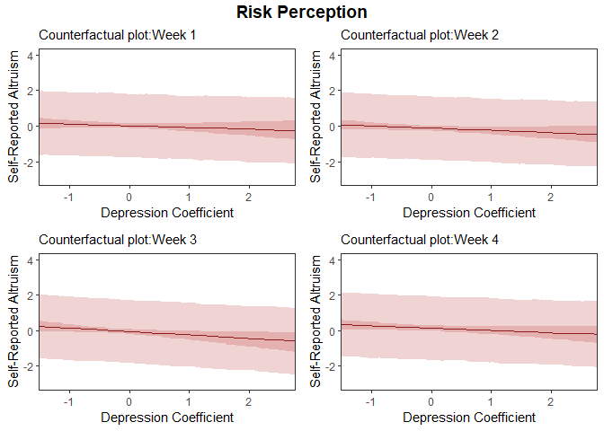
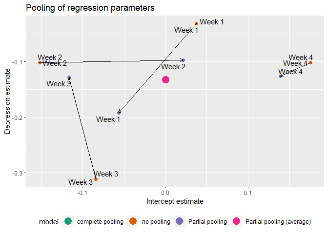

Threat Imminence And Everyday Altruism During The COVID-19 Pandemic
================
Stephen Pierzchajlo

# Research Question

Is increased COVID-19 threat over time associated with increased
altruism?

# Background

There is evidence to suggest that humans and other mammals respond to
potentially threatening events in a graded manner that depends on how
imminent they perceive the threat to be (Fanselow & Lester, 1988).
Imminence refers both to spatial proximity (whether something is far or
close in space), as well as temporal proximity (something happening
weeks from now versus something happening now). Distal (unpredictable)
threats are typically associated with risk assessment and appraisal
strategies, and usually trigger states of generalised stress.
Conversely, imminent (predictable) threats trigger rapid avoidance
responses and are usually associated with states of acute anxiety and
panic (Blanchard & Blanchard, 1990; Fanselow & Lester, 1988; Mobbs et
al., 2020). Importantly, there is recent evidence suggesting that
defensive states triggered by imminent danger may promote altruistic
motivation (Vieira et al., 2020a).

The data I will be analysing comes from a recent study (Vieira et al.,
2020b) conducted by Dr. Joana Vieira at Karolinska Instiutet to test how
COVID-19 threat imminence impacts acts of everyday altruism. The
pandemic represented a unique proxy for threat imminence as the number
of cases and deaths were increasing exponentially and therefore
represented a constantly approaching threat. Joana hypothesised that
increased COVID-19 threat over time would be associated with an increase
in self-reported altruistic acts. She predicted that measurements
associated with imminent threats during the pandemic would be associated
with an increase in altrustic acts, while measurements associated with
distal threats during the pandemic would not be associated with
self-reported altruism.

A paper is currently being prepared for publication (Vieira et al.,
2020b) using data for my current project here, but the paper uses only
frequentist analyses. I thought this would be the perfect dataset to try
a complimentary Bayesian analysis and use some techniques learned in
class. Additionally, the Bayesian analyses performed here will be
included as a suppimentary manuscript that readers can access via the
Open Science Framework (osf.io) to compare with the frequentist
analysis.

## Data Collection

Data for this analysis came from a study conducted online between March
24th and April 14th of 2020. Each week, 150 different people from the
United States were surveyed about a range of self-reported behaviours
and psychological states. Therefore, a total of 600 people were included
in the study, collected over 4 data acquisition periods. For the
purposes of this analysis, only the measurements directly associated
with the Bayesian model will be discussed. The dependent measure for
this study was each participants’ self-reported altruism (SRA) score.
The main predictors we collected and had hypotheses related to were:
COVID-19 Risk Perception (RP), Percieved Stress Score (PSS), Anxiety,
and Depression. We also collected each participants’ age, gender,
employment status, and financial situation. These latter 4 predictors
had no prior hypothesis tied to them, but we thought each could
contribute to predicting SRA. Later, each predictor will be very briefly
described as it relates to the hypothesis.

## COVID-19 Data Aquisition

To get a sense of where the United States was in terms of overall
COVID-19 cases during our data acquisition period, I obtained COVID-19
related data from github for those 4 weeks. I then created a dataframe
that contains only the weeks for which the data for the experiment took
place. The code chunk below puts this dataframe together.

``` r
# Line length
#-----------------------------------------------------------------------------80
#------------------------------------------------------------------------------------------------100
```

## Remove Golbal Environment

``` r
rm(list = ls())
```

## Load Libraries

``` r
# Load libraries
library(tidyr)
library(ggplot2)
library(gghighlight)
library(plyr)
library(readr)
library(plotly)
library(ggpubr)
library(dplyr)
library(bayesplot)
library(rethinking)
library(ggmcmc)
library(brms)
library(broom)
library(brmstools)
library(brms)
library(broom)
require(ggplot2)
require(gdata)
require(dplyr)
require(parallel)
require(cowplot)
library(bayesplot)
library(tidyverse)
library(rcartocolor)
library(ggrepel)
library(broom.mixed)
library(lme4)
library(tibble)
library(dplyr)
```

## Load Functions

``` r
# Load all user made functions.
source("../bin/counterfactual_plot.R")
source("../bin/counterfactual_plot_all.R")
source("../bin/posterior_plot.R")
source("../bin/survey_graph.R")
source("../bin/divergent_transitions.R")
```

## Load/Wrangle Raw Data

``` r
# Load .csv files from github. These are updated daily, so everytime this analysis is run, it uses the
# most up to date information.

# Total us cases data.
covid_us_wide <- read_csv(url("https://raw.githubusercontent.com/CSSEGISandData/COVID-19/master/csse_covid_19_data/csse_covid_19_time_series/time_series_covid19_confirmed_US.csv")) 

# Save total US cases data.
write.csv(covid_us_wide, "C:/Users/STPI0560/Desktop/R Projects/Covid-19-Altruism-Bayesian-Analysis/data/raw/covid_us_wide.csv", row.names = FALSE)

# Total US deaths data.
covid_us_deaths_wide <- read_csv(url("https://raw.githubusercontent.com/CSSEGISandData/COVID-19/master/csse_covid_19_data/csse_covid_19_time_series/time_series_covid19_deaths_US.csv"))

# Save total US deaths data.  
write.csv(covid_us_deaths_wide, "C:/Users/STPI0560/Desktop/R Projects/Covid-19-Altruism-Bayesian-Analysis/data/raw/covid_us_deaths_wide.csv", row.names = FALSE)

# Total global cases data in long format.
covid_us_long_date <- gather(covid_us_wide, date, cases, 12:ncol(covid_us_wide), factor_key = TRUE)

# Total global deaths data in long format
covid_us_deaths_long_date <- gather(covid_us_deaths_wide, date, cases, 13:ncol(covid_us_deaths_wide), factor_key = TRUE)

# Filter States as the  cases dataset also includes groups (American Samoa) and boats (Diamond Cruise ship).
covid_us_filter <- covid_us_long_date %>% 
  dplyr::filter(`Province_State` %in% c(
    "Alabama", "Alaska", "Arizona", "Arkansas", "California", "Colorado", "Connecticut",
    "Delaware", "District of Columbia", "Florida", "Georgia", "Hawaii", "Idaho", "Illinois",
    "Indiana", "Iowa", "Kansas", "Kentucky", "Louisiana", "Maine", "Maryland", "Massachusetts",
    "Michigan", "Minnesota", "Mississippi", "Missouri", "Montana", "Nebraska", "Nevada",
    "New Hampshire", "New Jersey", "New Mexico", "New York", "North Carolina", "North Dakota",
    "Ohio", "Oklahoma", "Oregon", "Pennsylvania", "Rhode Island", "South Carolina", "South Dakota",
    "Tennessee", "Texas", "Utah", "Vermont", "Virginia", "Washington", "West Virginia",
    "Wisconsin", "Wyoming")
    )

# Filter data to only include dates starting from March 1st.
covid_us_filter <- covid_us_filter[126558:nrow(covid_us_filter), ] %>%
  ddply(c("`Province_State`", "date"), summarise, cases = sum(cases))

# Filter States as the deaths dataset also includes groups (American Samoa) and boats (Diamond Cruise ship).
covid_us_deaths_filter <- covid_us_deaths_long_date %>%
  dplyr::filter(`Province_State` %in% c(
    "Alabama", "Alaska", "Arizona", "Arkansas", "California", "Colorado", "Connecticut",
    "Delaware", "District of Columbia", "Florida", "Georgia", "Hawaii", "Idaho", "Illinois",
    "Indiana", "Iowa", "Kansas", "Kentucky", "Louisiana", "Maine", "Maryland", "Massachusetts",
    "Michigan", "Minnesota", "Mississippi", "Missouri", "Montana", "Nebraska", "Nevada",
    "New Hampshire", "New Jersey", "New Mexico", "New York", "North Carolina", "North Dakota",
    "Ohio", "Oklahoma", "Oregon", "Pennsylvania", "Rhode Island", "South Carolina", "South Dakota",
    "Tennessee", "Texas", "Utah", "Vermont", "Virginia", "Washington", "West Virginia",
    "Wisconsin", "Wyoming")
    )

# Filter States as the dataset also includes groups (American Samoa) and boats (Diamond Cruise ship).
covid_us_deaths_filter <- covid_us_deaths_filter[126558:nrow(covid_us_deaths_filter), ] %>%
  ddply(c("`Province_State`", "date"), summarise, deaths = sum(cases))  %>%
  rename(null1 = Province_State,
         null2 = date)

# Bind cases and deaths dataframes.
covid_cases_deaths <- cbind(covid_us_filter, covid_us_deaths_filter) %>%
  rename(state = Province_State,
         date = date,
         total_state_cases = cases,
         total_state_deaths = deaths) %>%
  subset(select = c("state", "date", "total_state_cases", "total_state_deaths")) %>%
  mutate(
    "week" = case_when(
      date == "3/23/20" ~ "week_1",
      date == "3/30/20" ~ "week_2",
      date == "4/6/20" ~ "week_3",
      date == "4/13/20" ~ "week_4")
    ) %>%
  filter(!str_detect(week, "na"))

# New dataframe, summarising cases by week of data collection.
covid_cases <- ddply(covid_cases_deaths, c("state", "week"), summarise,
                     n = length(total_state_cases),
                     total_state_cases = sum(total_state_cases))

# New dataframe, summarising deaths by week of data collection.
covid_deaths <- ddply(covid_cases_deaths, c("state", "week"), summarise,
                      n = length(total_state_deaths),
                      total_state_deaths = sum(total_state_deaths))

# Dataframe combining summarised cases and deaths dataframes.
total_cases_and_deaths <- cbind(covid_cases, covid_deaths)

# Change column names.
colnames(total_cases_and_deaths) <- c(
  "state", "week", "n", "total_state_cases", "null1", "null2", "null3", "total_state_deaths"
  )

# Create master dataframe.
total_cases_and_deaths <- total_cases_and_deaths %>%
  subset(select = c("state", "week", "n", "total_state_cases", "total_state_deaths")) %>%
  mutate(
    "total_us_cases" = case_when(
      week == "week_1" ~ sum(total_state_cases[week == "week_1"]),
      week == "week_2" ~ sum(total_state_cases[week == "week_1"]),
      week == "week_3" ~ sum(total_state_cases[week == "week_1"]),
      week == "week_4" ~ sum(total_state_cases[week == "week_1"])
      ),
    "total_us_deaths" = case_when(
      week == "week_1" ~ sum(total_state_deaths[week == "week_1"]),
      week == "week_2" ~ sum(total_state_deaths[week == "week_1"]),
      week == "week_3" ~ sum(total_state_deaths[week == "week_1"]),
      week == "week_4" ~ sum(total_state_deaths[week == "week_1"])
      ),    
    "state_abb" = case_when(
      state == "Alabama" ~ "AL",
      state == "Alaska" ~ "AK",
      state == "Arizona" ~ "AZ",
      state == "Arkansas" ~ "AR",
      state == "California" ~ "CA",
      state == "Colorado" ~ "CO",
      state == "Connecticut" ~ "CT",
      state == "Delaware" ~ "DE",
      state == "District of Columbia" ~ "DC",      
      state == "Florida" ~ "FL",
      state == "Georgia" ~ "GA",
      state == "Hawaii" ~ "HI",
      state == "Idaho" ~ "ID",
      state == "Illinois" ~ "IL",
      state == "Indiana" ~ "IN",
      state == "Iowa" ~ "IA",
      state == "Kansas" ~ "KA",
      state == "Kentucky" ~ "KY",
      state == "Louisiana" ~ "LA",
      state == "Maine" ~ "MA",
      state == "Maryland" ~ "MD",
      state == "Massachusetts" ~ "MA",
      state == "Michigan" ~ "MI",
      state == "Minnesota" ~ "MN",
      state == "Mississippi" ~ "MS",
      state == "Missouri" ~ "MO",
      state == "Montana" ~ "MT",
      state == "Nebraska" ~ "NE",
      state == "Nevada" ~ "NV",
      state == "New Hampshire" ~ "NH",
      state == "New Jersey" ~ "NJ",
      state == "New Mexico" ~ "NM",
      state == "New York" ~ "NY",
      state == "North Carolina" ~ "NC",
      state == "North Dakota" ~ "ND",
      state == "Ohio" ~ "OH",
      state == "Oklahoma" ~ "OK",
      state == "Oregon" ~ "OR",
      state == "Pennsylvania" ~ "PA",
      state == "Rhode Island" ~ "RI",
      state == "South Carolina" ~ "SC",
      state == "South Dakota" ~ "SD",
      state == "Tennessee" ~ "TN",
      state == "Texas" ~ "TX",
      state == "Utah" ~ "UT",
      state == "Vermont" ~ "VT",
      state == "Virginia" ~ "VA",
      state == "Washington" ~ "WA",
      state == "West Virginia" ~ "WV",
      state == "Wisconsin" ~ "WI",
      state == "Wyoming" ~ "WY",
      TRUE ~ as.character(state)
      ),
    "cases_per_10000" = case_when(
      state == "Alabama" ~ (total_state_cases/4908621) * 10000,
      state == "Alaska" ~ (total_state_cases/734002) * 10000,
      state == "Arizona" ~ (total_state_cases/7378494) * 10000,
      state == "Arkansas" ~ (total_state_cases/3038999) * 10000,
      state == "California" ~ (total_state_cases/39937489) * 10000,
      state == "Colorado" ~ (total_state_cases/5845526) * 10000,
      state == "Connecticut" ~ (total_state_cases/3563077) * 10000,
      state == "Delaware" ~ (total_state_cases/982895) * 10000,
      state == "District of Columbia" ~ (total_state_cases/ 720687) * 10000,
      state == "Florida" ~ (total_state_cases/21992985) * 10000,
      state == "Georgia" ~ (total_state_cases/10736059) * 10000,
      state == "Hawaii" ~ (total_state_cases/1412687) * 10000,
      state == "Idaho" ~ (total_state_cases/1826156) * 10000,
      state == "Illinois" ~ (total_state_cases/12659682) * 10000,
      state == "Indiana" ~ (total_state_cases/6745354) * 10000,
      state == "Iowa" ~ (total_state_cases/3179849) * 10000,
      state == "Kansas" ~ (total_state_cases/2910357) * 10000,
      state == "Kentucky" ~ (total_state_cases/4499692) * 10000,
      state == "Louisiana" ~ (total_state_cases/4645184) * 10000,
      state == "Maine" ~ (total_state_cases/1345790) * 10000,
      state == "Maryland" ~ (total_state_cases/6083116) * 10000,
      state == "Massachusetts" ~ (total_state_cases/6976597) * 10000,
      state == "Michigan" ~ (total_state_cases/10045029) * 10000,
      state == "Minnesota" ~ (total_state_cases/5700671) * 10000,
      state == "Mississippi" ~ (total_state_cases/2989260) * 10000,
      state == "Missouri" ~ (total_state_cases/6169270) * 10000,
      state == "Montana" ~ (total_state_cases/1086759) * 10000,
      state == "Nebraska" ~ (total_state_cases/1952570) * 10000,
      state == "Nevada" ~ (total_state_cases/3139658) * 10000,
      state == "New Hampshire" ~ (total_state_cases/1371246) * 10000,
      state == "New Jersey" ~ (total_state_cases/8936574) * 10000,
      state == "New Mexico" ~ (total_state_cases/2096640) * 10000,
      state == "New York" ~ (total_state_cases/19440469) * 10000,
      state == "North Carolina" ~ (total_state_cases/10611862) * 10000,
      state == "North Dakota" ~ (total_state_cases/761723) * 10000,
      state == "Ohio" ~ (total_state_cases/11747694) * 10000,
      state == "Oklahoma" ~ (total_state_cases/3954821) * 10000,
      state == "Oregon" ~ (total_state_cases/4301089) * 10000,
      state == "Pennsylvania" ~ (total_state_cases/12820878) * 10000,
      state == "Rhode Island" ~ (total_state_cases/1056161) * 10000,
      state == "South Carolina" ~ (total_state_cases/5210095) * 10000,
      state == "South Dakota" ~ (total_state_cases/903027) * 10000,
      state == "Tennessee" ~ (total_state_cases/6897576) * 10000,
      state == "Texas" ~ (total_state_cases/29472295) * 10000,
      state == "Utah" ~ (total_state_cases/3282115) * 10000,
      state == "Vermont" ~ (total_state_cases/628061) * 10000,
      state == "Virginia" ~ (total_state_cases/8626207) * 10000,
      state == "Washington" ~ (total_state_cases/7797095) * 10000,
      state == "West Virginia" ~ (total_state_cases/1778070) * 10000,
      state == "Wisconsin" ~ (total_state_cases/5851754) * 10000,
      state == "Wyoming" ~ (total_state_cases/567025) * 10000,
      TRUE ~ as.double(state)
      ),
    "cases_per_100000" = case_when(
      state == "Alabama" ~ (total_state_cases/4908621) * 100000,
      state == "Alaska" ~ (total_state_cases/734002) * 100000,
      state == "Arizona" ~ (total_state_cases/7378494) * 100000,
      state == "Arkansas" ~ (total_state_cases/3038999) * 100000,
      state == "California" ~ (total_state_cases/39937489) * 100000,
      state == "Colorado" ~ (total_state_cases/5845526) * 100000,
      state == "Connecticut" ~ (total_state_cases/3563077) * 100000,
      state == "Delaware" ~ (total_state_cases/982895) * 100000,
      state == "District of Columbia" ~ (total_state_cases/ 720687) * 100000,
      state == "Florida" ~ (total_state_cases/21992985) * 100000,
      state == "Georgia" ~ (total_state_cases/10736059) * 100000,
      state == "Hawaii" ~ (total_state_cases/1412687) * 100000,
      state == "Idaho" ~ (total_state_cases/1826156) * 100000,
      state == "Illinois" ~ (total_state_cases/12659682) * 100000,
      state == "Indiana" ~ (total_state_cases/6745354) * 100000,
      state == "Iowa" ~ (total_state_cases/3179849) * 100000,
      state == "Kansas" ~ (total_state_cases/2910357) * 100000,
      state == "Kentucky" ~ (total_state_cases/4499692) * 100000,
      state == "Louisiana" ~ (total_state_cases/4645184) * 100000,
      state == "Maine" ~ (total_state_cases/1345790) * 100000,
      state == "Maryland" ~ (total_state_cases/6083116) * 100000,
      state == "Massachusetts" ~ (total_state_cases/6976597) * 100000,
      state == "Michigan" ~ (total_state_cases/10045029) * 100000,
      state == "Minnesota" ~ (total_state_cases/5700671) * 100000,
      state == "Mississippi" ~ (total_state_cases/2989260) * 100000,
      state == "Missouri" ~ (total_state_cases/6169270) * 100000,
      state == "Montana" ~ (total_state_cases/1086759) * 100000,
      state == "Nebraska" ~ (total_state_cases/1952570) * 100000,
      state == "Nevada" ~ (total_state_cases/3139658) * 100000,
      state == "New Hampshire" ~ (total_state_cases/1371246) * 100000,
      state == "New Jersey" ~ (total_state_cases/8936574) * 100000,
      state == "New Mexico" ~ (total_state_cases/2096640) * 100000,
      state == "New York" ~ (total_state_cases/19440469) * 100000,
      state == "North Carolina" ~ (total_state_cases/10611862) * 100000,
      state == "North Dakota" ~ (total_state_cases/761723) * 100000,
      state == "Ohio" ~ (total_state_cases/11747694) * 100000,
      state == "Oklahoma" ~ (total_state_cases/3954821) * 100000,
      state == "Oregon" ~ (total_state_cases/4301089) * 100000,
      state == "Pennsylvania" ~ (total_state_cases/12820878) * 100000,
      state == "Rhode Island" ~ (total_state_cases/1056161) * 100000,
      state == "South Carolina" ~ (total_state_cases/5210095) * 100000,
      state == "South Dakota" ~ (total_state_cases/903027) * 100000,
      state == "Tennessee" ~ (total_state_cases/6897576) * 100000,
      state == "Texas" ~ (total_state_cases/29472295) * 100000,
      state == "Utah" ~  (total_state_cases/3282115) * 100000,
      state == "Vermont" ~ (total_state_cases/628061) * 100000,
      state == "Virginia" ~ (total_state_cases/8626207) * 100000,
      state == "Washington" ~ (total_state_cases/7797095) * 100000,
      state == "West Virginia" ~ (total_state_cases/1778070) * 100000,
      state == "Wisconsin" ~ (total_state_cases/5851754) * 100000,
      state == "Wyoming" ~ (total_state_cases/567025) * 100000,
      TRUE ~ as.double(state)
      ),
    "deaths_per_10000" = case_when(
      state == "Alabama" ~ (total_state_cases/4908621) * 10000,
      state == "Alaska" ~ (total_state_cases/734002) * 10000,
      state == "Arizona" ~ (total_state_cases/7378494) * 10000,
      state == "Arkansas" ~ (total_state_cases/3038999) * 10000,
      state == "California" ~ (total_state_cases/39937489) * 10000,
      state == "Colorado" ~ (total_state_cases/5845526) * 10000,
      state == "Connecticut" ~ (total_state_cases/3563077) * 10000,
      state == "Delaware" ~ (total_state_cases/982895) * 10000,
      state == "District of Columbia" ~ (total_state_cases/ 720687) * 10000,
      state == "Florida" ~ (total_state_cases/21992985) * 10000,
      state == "Georgia" ~ (total_state_cases/10736059) * 10000,
      state == "Hawaii" ~ (total_state_cases/1412687) * 10000,
      state == "Idaho" ~ (total_state_cases/1826156) * 10000,
      state == "Illinois" ~ (total_state_cases/12659682) * 10000,
      state == "Indiana" ~ (total_state_cases/6745354) * 10000,
      state == "Iowa" ~ (total_state_cases/3179849) * 10000,
      state == "Kansas" ~ (total_state_cases/2910357) * 10000,
      state == "Kentucky" ~ (total_state_cases/4499692) * 10000,
      state == "Louisiana" ~ (total_state_cases/4645184) * 10000,
      state == "Maine" ~ (total_state_cases/1345790) * 10000,
      state == "Maryland" ~ (total_state_cases/6083116) * 10000,
      state == "Massachusetts" ~ (total_state_cases/6976597) * 10000,
      state == "Michigan" ~ (total_state_cases/10045029) * 10000,
      state == "Minnesota" ~ (total_state_cases/5700671) * 10000,
      state == "Mississippi" ~ (total_state_cases/2989260) * 10000,
      state == "Missouri" ~ (total_state_cases/6169270) * 10000,
      state == "Montana" ~ (total_state_cases/1086759) * 10000,
      state == "Nebraska" ~ (total_state_cases/1952570) * 10000,
      state == "Nevada" ~ (total_state_cases/3139658) * 10000,
      state == "New Hampshire" ~ (total_state_cases/1371246) * 10000,
      state == "New Jersey" ~ (total_state_cases/8936574) * 10000,
      state == "New Mexico" ~ (total_state_cases/2096640) * 10000,
      state == "New York" ~ (total_state_cases/19440469) * 10000,
      state == "North Carolina" ~ (total_state_cases/10611862) * 10000,
      state == "North Dakota" ~ (total_state_cases/761723) * 10000,
      state == "Ohio" ~ (total_state_cases/11747694) * 10000,
      state == "Oklahoma" ~ (total_state_cases/3954821) * 10000,
      state == "Oregon" ~ (total_state_cases/4301089) * 10000,
      state == "Pennsylvania" ~ (total_state_cases/12820878) * 10000,
      state == "Rhode Island" ~ (total_state_cases/1056161) * 10000,
      state == "South Carolina" ~ (total_state_cases/5210095) * 10000,
      state == "South Dakota" ~ (total_state_cases/903027) * 10000,
      state == "Tennessee" ~ (total_state_cases/6897576) * 10000,
      state == "Texas" ~ (total_state_cases/29472295) * 10000,
      state == "Utah" ~ (total_state_cases/3282115) * 10000,
      state == "Vermont" ~ (total_state_cases/628061) * 10000,
      state == "Virginia" ~ (total_state_cases/8626207) * 10000,
      state == "Washington" ~ (total_state_cases/7797095) * 10000,
      state == "West Virginia" ~ (total_state_cases/1778070) * 10000,
      state == "Wisconsin" ~ (total_state_cases/5851754) * 10000,
      state == "Wyoming" ~ (total_state_cases/567025) * 10000,
      TRUE ~ as.double(state)
      ),
    "deaths_per_100000" = case_when(
      state == "Alabama" ~ (total_state_cases/4908621) * 100000,
      state == "Alaska" ~ (total_state_cases/734002) * 100000,
      state == "Arizona" ~ (total_state_cases/7378494) * 100000,
      state == "Arkansas" ~ (total_state_cases/3038999) * 100000,
      state == "California" ~ (total_state_cases/39937489) * 100000,
      state == "Colorado" ~ (total_state_cases/5845526) * 100000,
      state == "Connecticut" ~ (total_state_cases/3563077) * 100000,
      state == "District of Columbia" ~ (total_state_cases/ 720687) * 100000,
      state == "Delaware" ~ (total_state_cases/982895) * 100000,
      state == "Florida" ~ (total_state_cases/21992985) * 100000,
      state == "Georgia" ~ (total_state_cases/10736059) * 100000,
      state == "Hawaii" ~ (total_state_cases/1412687) * 100000,
      state == "Idaho" ~ (total_state_cases/1826156) * 100000,
      state == "Illinois" ~ (total_state_cases/12659682) * 100000,
      state == "Indiana" ~ (total_state_cases/6745354) * 100000,
      state == "Iowa" ~ (total_state_cases/3179849) * 100000,
      state == "Kansas" ~ (total_state_cases/2910357) * 100000,
      state == "Kentucky" ~ (total_state_cases/4499692) * 100000,
      state == "Louisiana" ~ (total_state_cases/4645184) * 100000,
      state == "Maine" ~ (total_state_cases/1345790) * 100000,
      state == "Maryland" ~ (total_state_cases/6083116) * 100000,
      state == "Massachusetts" ~ (total_state_cases/6976597) * 100000,
      state == "Michigan" ~  (total_state_cases/10045029) * 100000,
      state == "Minnesota" ~  (total_state_cases/5700671) * 100000,
      state == "Mississippi" ~ (total_state_cases/2989260) * 100000,
      state == "Missouri" ~ (total_state_cases/6169270) * 100000,
      state == "Montana" ~ (total_state_cases/1086759) * 100000,
      state == "Nebraska" ~ (total_state_cases/1952570) * 100000,
      state == "Nevada" ~ (total_state_cases/3139658) * 100000,
      state == "New Hampshire" ~ (total_state_cases/1371246) * 100000,
      state == "New Jersey" ~ (total_state_cases/8936574) * 100000,
      state == "New Mexico" ~ (total_state_cases/2096640) * 100000,
      state == "New York" ~ (total_state_cases/19440469) * 100000,
      state == "North Carolina" ~ (total_state_cases/10611862) * 100000,
      state == "North Dakota" ~ (total_state_cases/761723) * 100000,
      state == "Ohio" ~ (total_state_cases/11747694) * 100000,
      state == "Oklahoma" ~ (total_state_cases/3954821) * 100000,
      state == "Oregon" ~ (total_state_cases/4301089) * 100000,
      state == "Pennsylvania" ~ (total_state_cases/12820878) * 100000,
      state == "Rhode Island" ~ (total_state_cases/1056161) * 100000,
      state == "South Carolina" ~ (total_state_cases/5210095) * 100000,
      state == "South Dakota" ~ (total_state_cases/903027) * 100000,
      state == "Tennessee" ~ (total_state_cases/6897576) * 100000,
      state == "Texas" ~ (total_state_cases/29472295) * 100000,
      state == "Utah" ~ (total_state_cases/3282115) * 100000,
      state == "Vermont" ~ (total_state_cases/628061) * 100000,
      state == "Virginia" ~ (total_state_cases/8626207) * 100000,
      state == "Washington" ~ (total_state_cases/7797095) * 100000,
      state == "West Virginia" ~ (total_state_cases/1778070) * 100000,
      state == "Wisconsin" ~ (total_state_cases/5851754) * 100000,
      state == "Wyoming" ~ (total_state_cases/567025) * 100000,
      TRUE ~ as.double(state))) %>%
  mutate(across(total_us_cases, as.double)) %>%
  mutate(across(total_us_deaths, as.double))%>%
  select(-(state))  %>%
  mutate(state = state_abb) %>%
  select(-(state_abb)) 
  
write.csv(total_cases_and_deaths, "C:/Users/STPI0560/Desktop/R Projects/Covid-19-Altruism-Bayesian-Analysis/data/processed/total_cases_and_deaths.csv",
          row.names = FALSE)

# Glimps first few rows of new dataframe.
head(total_cases_and_deaths)
```

    ##     week n total_state_cases total_state_deaths total_us_cases total_us_deaths
    ## 1 week_1 1               224                  0          45952             788
    ## 2 week_2 1              1001                 10          45952             788
    ## 3 week_3 1              2079                 49          45952             788
    ## 4 week_4 1              3870                 99          45952             788
    ## 5 week_1 1                39                  0          45952             788
    ## 6 week_2 1               119                  3          45952             788
    ##   cases_per_10000 cases_per_100000 deaths_per_10000 deaths_per_100000 state
    ## 1       0.4563400         4.563400        0.4563400          4.563400    AL
    ## 2       2.0392693        20.392693        2.0392693         20.392693    AL
    ## 3       4.2354054        42.354054        4.2354054         42.354054    AL
    ## 4       7.8840880        78.840880        7.8840880         78.840880    AL
    ## 5       0.5313337         5.313337        0.5313337          5.313337    AK
    ## 6       1.6212490        16.212490        1.6212490         16.212490    AK

The dataframe above shows just the first 6 rows. Each row contains the
total COVID-19 cases and deaths (and some per capita information) in a
specific State during one of the four Weeks we collected data. Later, I
will plot some of this information for interests sake.

## Survey Data Pre-processing

Below I read in the raw survey data from our study, and then
combined/removed some data. The steps taken and data removed can be
looked at more closely in the code chunk below. Some of the data are
recoded as well and consists of variables that are used in the study but
not used in this assignment.

Please note that the data are available on the osf page for this study:
<https://osf.io/8w6x2/>

The file on the osf page is called “CVA\_full.csv”.

``` r
## Load experiment dataset
cva_new <- read.csv("C:/Users/STPI0560/Desktop/R Projects/Covid-19-Altruism-Bayesian-Analysis/data/raw/cva.csv") %>%
  filter(!(SubID == "294b")) %>%
  mutate(
    "sra" = SRA1 + SRA2 + SRA3 + SRA4 + SRA5 + SRA6 + SRA7 + SRA8 + SRA9 + SRA10 + SRA11 + SRA12 +
      SRA13 + SRA14 + SRA15 + SRA16 + SRA17 + SRA18 + SRA19 + SRA20,
    "donations" = SRA4 + SRA5 + SRA6 + SRA7 + SRA8,
    "rp" = RP1 + RP2 + RP3 + RP4 + RP5 + RP6 + RP7 + RP8 + RP9 + RP10,
    "pbi" = (PSI1 + PSI2 + PSI3 + PSI4)/4,
    "pbi_s" = (PSI2 + PSI4)/2,
    "pbi_r" = (PSI1 + PSI3)/2,
    "ps4_r" = case_when(
      PS4 == "0" ~ 4,
      PS4 == "1" ~ 3,
      PS4 == "2" ~ 2,
      PS4 == "3" ~ 1,
      PS4 >= "4" ~ 0
      ),
    "ps5_r" = case_when(
      PS5 == "0" ~ 4,
      PS5 == "1" ~ 3,
      PS5 == "2" ~ 2,
      PS5 == "3" ~ 1,
      PS5 >= "4" ~ 0
      ),    
    "ps7_r" = case_when(
      PS7 == "0" ~ 4,
      PS7 == "1" ~ 3,
      PS7 == "2" ~ 2,
      PS7 == "3" ~ 1,
      PS7 >= "4" ~ 0
      ),     
    "ps8_r" = case_when(
      PS8 == "0" ~ 4,
      PS8 == "1" ~ 3,
      PS8 == "2" ~ 2,
      PS8 == "3" ~ 1,
      PS8 >= "4" ~ 0
      ),    
    "depression" = (D3 + D5 + D10 + D13 + D16 + D17 + D21) * 2,
    "anxiety" = (D2 + D4 + D7 + D9 + D15 + D19 + D20) * 2,
    "stress" = (D1 + D6 + D8 + D11 + D12 + D14 + D18) * 2,
    "week" = case_when(
      Timepoint == "1" ~ "Week 1",
      Timepoint == "2" ~ "Week 2",
      Timepoint == "3" ~ "Week 3",
      Timepoint == "4" ~ "Week 4"
      ),
    "employment" = case_when(
      Emp == "1" ~ "Employed",
      Emp == "2" ~ "Unemployed",
      Emp == "3" ~ "Student"
      ),
    "gender2" = case_when(
      Gender == "1" ~ "Male",
      Gender == "2" ~ "Female",
      Gender == "3" ~ "Other"
      ),
    "education" = case_when(
      Edu == "1" ~ "High school or below",
      Edu == "2" ~ "University degree",
      Edu == "3" ~ "Graduate degree"
      )) %>%
  mutate(
    "pss" = PS1 + PS2 + PS3 + ps4_r + ps5_r + PS6 + ps7_r + ps8_r + PS9 + PS10
    )

names(cva_new)[names(cva_new) == 'State'] <- 'state'
```

Next, the COVID-19 data and survey data were combined to form a single
dataframe. A bit later, I will plot both total cases per State, as well
as self-reported altruism score per State over the course of each Week
that data acquisition took place.

``` r
# Join COVID survey and COVID U.S.A data.
cva_full <- full_join(cva_new, total_cases_and_deaths, by = c("state", "week")) %>%
  filter(!(SubID == "NA"))

# Display dataframe form analysis
head(cva_full)
```

    ##   SubID Timepoint  ID               ProlificID Age Gender SEL Country state Emp
    ## 1   287         2 139 5d288c5cc3c61e001781c77d  19      2   2       2    AK   3
    ## 2   384         3  85 5c802d06948f9c00017b3eb2  35      1   4       2    AK   2
    ## 3    87         1 196 58af423e6590840001566cc7  32      1   3       2    AL   1
    ## 4   198         2  48 5e72665f88152e1aecef02ff  20      2   4       2    AL   3
    ## 5   240         2  90 5cbdc86714b3cb0001f035bb  38      2   2       2    AL   1
    ## 6   333         3  34 5dab9bb23dd8f50015d256d5  46      2   1       2    AL   2
    ##   Edu SRA1 SRA2 SRA3 SRA4 SRA5 SRA6 SRA7 SRA8 SRA9 SRA10 SRA11 SRA12 SRA13
    ## 1   1    1    3    2    3    1    3    4    1    3     3     3     1     3
    ## 2   2    3    3    3    4    2    4    2    2    3     5     4     1     2
    ## 3   1    2    4    1    3    3    1    1    2    1     5     3     1     3
    ## 4   1    1    3    1    3    1    3    1    1    2     4     3     1     1
    ## 5   1    1    3    2    2    2    3    2    1    2     3     3     2     1
    ## 6   1    1    5    5    3    3    5    3    3    5     5     5     2     5
    ##   SRA14 SRA15 SRA16 SRA17 SRA18 SRA19 SRA20 VAR029 PSI1 PSI2 PSI3 PSI4 relative
    ## 1     1     1     4     2     3     3     2           7    5    4    7       NA
    ## 2     2     1     3     3     3     3     3           7    5    6    5        3
    ## 3     3     1     3     1     1     1     5           7    7    7    7       NA
    ## 4     2     1     3     1     1     1     2           5    3    6    5       NA
    ## 5     1     1     1     1     3     1     3           7    7    7    7       NA
    ## 6     5     1     5     5     1     5     5           7    7    7    7        4
    ##   friend acquaint stranger ingroup outgroup VAR033 ownn othern political
    ## 1     NA       NA       NA      NA       NA           3      3         2
    ## 2      3        1        1       2        1    N/A    1      3         1
    ## 3     NA       NA       NA      NA       NA           3      4         1
    ## 4     NA       NA       NA      NA       NA           2      3         1
    ## 5     NA       NA       NA      NA       NA           3      3         3
    ## 6      4        4        4       4        4           3      3         3
    ##   identify help VAR039 PS1 PS2 PS3 PS4 PS5 PS6 PS7 PS8 PS9 PS10
    ## 1        2    3          4   4   3   1   1   1   4   0   3    4
    ## 2        1    1    N/A   3   4   3   3   1   3   2   2   2    2
    ## 3        3    3          1   2   1   3   2   1   3   3   1    1
    ## 4        3    1          3   4   4   2   1   3   2   1   2    2
    ## 5        3    3          2   2   2   2   2   2   2   1   2    2
    ## 6        3    3          4   4   4   1   1   2   1   1   4    4
    ##                                                                       VAR050 D1
    ## 1                                                                             3
    ## 2 I have Lyme Disease, so things have been difficult for a long time for me.  1
    ## 3                                                                             0
    ## 4                                                                             1
    ## 5                                                                             0
    ## 6                                                                             3
    ##   D2 D3 D4 D5 D6 D7 D8 D9 D10 D11 D12 D13 D14 D15 D16 D17 D18 D19 D20 D21
    ## 1  2  1  1  3  0  0  1  1   3   1   2   0   2   0   1   0   0   0   0   0
    ## 2  0  1  0  1  2  1  0  0   1   2   1   1   1   0   1   0   1   0   0   0
    ## 3  0  0  0  0  0  0  0  0   0   0   1   0   0   0   0   0   0   0   0   0
    ## 4  0  1  0  2  0  0  1  0   2   0   2   1   0   0   1   0   0   0   0   0
    ## 5  0  1  0  1  1  0  1  1   1   1   0   1   1   1   1   1   1   0   0   1
    ## 6  3  1  0  3  3  1  1  0   1   2   2   2   3   1   1   2   3   1   1   2
    ##   VAR072 RP1 RP2 RP3 RP4 RP5 RP6 RP7 RP8 RP9 RP10 VAR083 socialm personalcom
    ## 1          2   1   5   7   5   3   3   3   5    6              4           3
    ## 2    N/A   4   7   1   4   4   5   6   6   5    7              1           4
    ## 3          2   3   4   4   2   2   2   2   4    3              5           5
    ## 4          3   6   6   3   7   7   7   6   7    6              4           2
    ## 5          4   4   4   5   4   4   4   4   4    4              3           3
    ## 6          4   6   7   7   4   4   4   4   4    4              3           3
    ##   mainnews indnews personalexp
    ## 1        5       1           1
    ## 2        3       1           3
    ## 3        5       3           1
    ## 4        5       3           1
    ## 5        1       1           1
    ## 6        4       4           2
    ##                                                                           VAR089
    ## 1                                                                               
    ## 2 A friend of mine does much of the COVID19 lab testing for the state of Alaska.
    ## 3                                                                               
    ## 4                                                                               
    ## 5                                                                               
    ## 6                                                                               
    ##   alc1 alc2 alc3 control
    ## 1    4    5    3       4
    ## 2    3    2    1       4
    ## 3    4    3    3       4
    ## 4    1    1    1       4
    ## 5    1    1    1       4
    ## 6    2    2    1       4
    ##                                                                VAR094 sra
    ## 1                                                                      47
    ## 2 Alcohol exacerbates my Lyme Disease symptoms, so I seldom partake.   56
    ## 3                                                                      45
    ## 4                                                                      36
    ## 5                                                                      38
    ## 6                                                                      77
    ##   donations rp  pbi pbi_s pbi_r ps4_r ps5_r ps7_r ps8_r depression anxiety
    ## 1        12 40 5.75     6   5.5     3     3     0     4         16       8
    ## 2        14 49 5.75     5   6.5     1     3     2     2         10       2
    ## 3        10 28 7.00     7   7.0     1     2     1     1          0       0
    ## 4         9 58 4.75     4   5.5     2     3     2     3         14       0
    ## 5        10 41 7.00     7   7.0     2     2     2     3         14       4
    ## 6        17 48 7.00     7   7.0     3     3     3     3         24      14
    ##   stress   week employment gender2            education pss  n
    ## 1     18 Week 2    Student  Female High school or below  29 NA
    ## 2     16 Week 3 Unemployed    Male    University degree  25 NA
    ## 3      2 Week 1   Employed    Male High school or below  12 NA
    ## 4      8 Week 2    Student  Female High school or below  28 NA
    ## 5     10 Week 2   Employed  Female High school or below  21 NA
    ## 6     34 Week 3 Unemployed  Female High school or below  34 NA
    ##   total_state_cases total_state_deaths total_us_cases total_us_deaths
    ## 1                NA                 NA             NA              NA
    ## 2                NA                 NA             NA              NA
    ## 3                NA                 NA             NA              NA
    ## 4                NA                 NA             NA              NA
    ## 5                NA                 NA             NA              NA
    ## 6                NA                 NA             NA              NA
    ##   cases_per_10000 cases_per_100000 deaths_per_10000 deaths_per_100000
    ## 1              NA               NA               NA                NA
    ## 2              NA               NA               NA                NA
    ## 3              NA               NA               NA                NA
    ## 4              NA               NA               NA                NA
    ## 5              NA               NA               NA                NA
    ## 6              NA               NA               NA                NA

The dataframe consists of 601 columns, and is what I will use for my
Bayesian analysis. Each row is data collected from one participant, and
also contains data about the number of cases and deaths for the week the
data was collected for the State each participant comes from. There are
many additional variables as well that are not important for the current
analysis.

## Create Measurement Scales

Their were 5 major scales that make up the dependent and independent
measures used in the survey study, and they will briefly be discussed
here. The Self-Reported Altruism Scale (SRA; Rushton et al., 1981) asks
participants to rate the frequency with which they engaged in various
altruistic acts. COVID-19 Risk Perception (RP) was assessed using a
modified scale from Wise et al. (2020) and asks participants about their
percieved risk of COVID-19 related infection and related
personal/financial worries. Defensive emotions were indexed via the
Percieved Stress Scale (PSS-10; Cohen et al., 1983) and the Depression
Anxiety Stress Scale (DASS-21; Lovibond & Lovibond, 1995). The PSS-10
asks participants about experiences of stress related to unpredictable
and uncontrollable events in their lives. The DASS-21 contains an
anxiety scale related to acute anxiety/panic and autonomic arrousal. The
DASS-21 also contains questons related to experienced depressive
episodes, and these depression-related questions are also included as a
seperate predictor in the model.

Below, I created some graphs to help visualise the distribution of
scores for each measure. These are simply to help visualise how
participants responded, and contain the responses from all 600
individuals.

``` r
# Subset questionnaire data
cva_subset <- cva_new %>%
  select(
    "PS1", "PS2", "PS3", "PS4", "PS5", "PS6", "PS7", "PS8", "PS9", "PS10", "D1", "D2", "D4", "D6",
    "D7", "D8", "D9", "D11", "D12", "D14", "D15", "D18", "D19", "D20", "RP1", "RP2", "RP3", "RP4",
    "RP5", "RP6", "RP7", "RP8", "RP9", "RP10", "SRA1", "SRA2", "SRA3", "SRA4", "SRA5", "SRA6",
    "SRA7", "SRA8", "SRA9", "SRA10", "SRA11", "SRA12", "SRA13", "SRA14", "SRA15", "SRA16", "SRA17",
    "SRA18", "SRA19", "SRA20"
    ) %>%
  # Reverse code reversed questionnaire items.
  mutate(
    "PS4" = case_when(
      PS4 == "0" ~ 4,
      PS4 == "1" ~ 3,
      PS4 == "2" ~ 2,
      PS4 == "3" ~ 1,
      PS4 == "4" ~ 0
      ),
    "PS5" = case_when(
      PS5 == "0" ~ 4,
      PS5 == "1" ~ 3,
      PS5 == "2" ~ 2,
      PS5 == "3" ~ 1,
      PS5 == "4" ~ 0
      ),    
    "PS7" = case_when(
      PS7 == "0" ~ 4,
      PS7 == "1" ~ 3,
      PS7 == "2" ~ 2,
      PS7 == "3" ~ 1,
      PS7 == "4" ~ 0
      ),    
    "PS8" = case_when(
      PS8 == "0" ~ 4,
      PS8 == "1" ~ 3,
      PS8 == "2" ~ 2,
      PS8 == "3" ~ 1,
      PS8 == "4" ~ 0
      )) %>%
  rename_all(tolower)

# Add questions and answers to each item. Note: Questions not included in graphs for space reasons.

# PS questionnaire.
cva_ps_long <- cva_subset %>%
  select(1:10) %>%
  gather(key = ps, value = "measure", ps1:ps10) %>%
  mutate(
    "question" = case_when(
      ps == "ps1" ~ "How often have you been upset because of something that happened
      unexpectedly?",
      ps == "ps2" ~ "How often have you felt you were unable to control the important things in your
      life?",
      ps == "ps3" ~ "How often have you felt nervous and stressed?",
      ps == "ps4" ~ "How often have you felt confident about your ability to handle your personal
      problems?",
      ps == "ps5" ~ "How often have you felt that things were going your way?",
      ps == "ps6" ~ "How often have you found that you could not cope with all the things you had to
      do?",
      ps == "ps7" ~ "How often have you been able to control irritations in your life?",
      ps == "ps8" ~ "How often have you felt that you were on top of things?",
      ps == "ps9" ~ "How often have you been angered because of things that were outside your
      control?",
      ps == "ps10" ~ "How often have you felt difficulties were pilling up so high that you could
      not overcome them?",
      TRUE ~ as.character(ps)
      ),
    "answer" = case_when(
      measure == 0 ~ "1. Never",
      measure == 1 ~ "2. Almost never",
      measure == 2 ~ "3. Sometimes",
      measure == 3 ~ "4. Fairly often",
      measure == 4 ~ "5. Very often",
      TRUE ~ as.character(measure))
    )

# Depression questionnaire.
cva_d_long <- cva_subset %>% 
  select(11:24) %>%
  gather(key = d, value = "measure", d1:d20) %>%
  mutate(
    "question" = case_when(
      d == "d1" ~ "I found it hard to wind down",
      d == "d2" ~ "I was aware of dryness of my mouth",
      d == "d4" ~ "I experienced breathing difficulty",
      d == "d6" ~ "I tended to overreact to situations",
      d == "d7" ~ "I experienced trembling",
      d == "d8" ~ "I felt I was using a lot of nervous energy",
      d == "d9" ~ "I was worried about situations where I might panic and make a fool of myself",
      d == "d11" ~ "I found myself getting agitated",
      d == "d12" ~ "I found it difficult to relax",
      d == "d14" ~ "I was intolerant of anything that kept me from getting on with what I was
      doing",
      d == "d15" ~ "I felt I was close to panic",
      d == "d18" ~ "I felt I was rather touchy",
      d == "d19" ~ "I was aware of the action of my heart in the absence of physical exertion",
      d == "d20" ~ "I felt scared without any good reason",
      TRUE ~ as.character(d)
      ),
    "answer" = case_when(
      measure == 0 ~ "1. Did not apply to me at all",
      measure == 1 ~ "2. Applied to me to some degree",
      measure == 2 ~ "3. Applied to me to a great degree",
      measure == 3 ~ "4. Applied to me most of the time",
      TRUE ~ as.character(measure))
    )

# RP questionnaire.
cva_rp_long <- cva_subset %>%
  select(25:34) %>%
  gather(key = rp, value = "measure", rp1:rp10) %>%
  mutate(
    "question" = case_when(
      rp == "rp1" ~ "How likely do you think you are to catch the virus?",
      rp == "rp2" ~ "How badly do you think your health will be affected if you do catch the
      virus?",
      rp == "rp3" ~ "How badly do you think you will be affected economically if you specifically
      catch the virus?",
      rp == "rp4" ~ "How badly do you think you will be affected by the global effects of the
      virus?",
      rp == "rp5" ~ "How likely do you think it is that a loved one will become infected?",
      rp == "rp6" ~ "How likely do you think the average person in your neighbourhood is to become
      infected?",
      rp == "rp7" ~ " How likely do you think the average person in your state is to become
      infected?",
      rp == "rp8" ~ "How likely do you think the average person in your country is to become
      infected?",
      rp == "rp9" ~ "If you do contract the virus, how likely do you think it is that you will pass
      it on to someone else?",
      rp == "v10" ~ "If you do contract the virus and pass it on to someone else, how badly do you
      think they would be affected?",
      TRUE ~ as.character(rp)
      ),
    "answer" = case_when(
      measure == 0 ~ "1. Never",
      measure == 1 ~ "2. Almost never",
      measure == 2 ~ "3. Sometimes",
      measure == 3 ~ "4. Fairly often",
      measure == 4 ~ "5. Very often",
      TRUE ~ as.character(measure))
    )

# SRA questionnaire
cva_sra_long <- cva_subset %>%
  select(35:54) %>%
  gather(key = sra, value = "measure", sra1:sra20) %>%
  mutate(
    "question" = case_when(
      sra == "sra1" ~ "I have helped push a stranger’s car out of the snow",
      sra == "sra2" ~ "I have given directions to a stranger",
      sra == "sra3" ~ "I have made change for a stranger",
      sra == "sra4" ~ "I have given money to a charity",
      sra == "sra5" ~ "I have given money to a stranger who needed it",
      sra == "sra6" ~ "I have donated goods or clothes to a charity",
      sra == "sra7" ~ "I have done volunteer work for a charity",
      sra == "sra8" ~ "I have donated blood",
      sra == "sra9" ~ "I have helped carry a stranger’s belongings",
      sra == "sra10" ~ "I have delayed an elevator and held the door open for a stranger",
      sra == "sra11" ~ "I have allowed someone to go ahead of me in a lineup",
      sra == "sra12" ~ "I have given a stranger a lift in my car",
      sra == "sra13" ~ "I have pointed out a clerk’s error in undercharging me for an item",
      sra == "sra14" ~ "I have let a neighbour whom I didn’t know too well borrow an item of some
      value to me",
      sra == "sra15" ~ "I have bought ‘charity” Christmas cards deliberately because I knew it was a
      good cause.",
      sra == "sra16" ~ "I have helped a classmate who I did not know that well with a homework
      assignment when my knowledge was greater",
      sra == "sra17" ~ "I have before being asked, voluntarily looked after a neighbour’s pets or
      children without being paid for it",
      sra == "sra18" ~ "I have offered to help a handicapped or elderly stranger across a street",
      sra == "sra19" ~ "I have offered my seat on a bus or train to a stranger who was standing",
      sra == "sra20" ~ "I have helped an acquaintance to move households",
      TRUE ~ as.character(sra)
      ),
    "answer" = case_when(
      measure == 1 ~ "1. Never",
      measure == 2 ~ "2. Once",
      measure == 3 ~ "3. More than once",
      measure == 4 ~ "4. Often",
      measure == 5 ~ "5. Very often",
      TRUE ~ as.character(measure))
    )
```

``` r
# Plot PS questionnaire data.
survey_graph(cva_ps_long, ps, answer, "Perceived Stress Scale")
```

<!-- -->

``` r
# Plot depression questionnaire data.
survey_graph(cva_d_long, d, answer, "Depression, Anxiety, and Stress Scale")
```

<!-- -->

This graph contains scores for both acute anxiety related questions, and
depression related questions.

``` r
# Plot RP questionnaire data.
survey_graph(cva_rp_long, rp, answer, "COVID-19 Risk Perception Questionnaire")
```

<!-- -->

``` r
# Plot SRA questionnaire data.
survey_graph(cva_sra_long, sra, answer, "Self-Reported Altruism Scale")
```

<!-- -->

# Additional Predictors

There was additonal data collected that had no explicit hypotheses
associated with them, but that we thought might still predict altruism
in general. After the initial model is fit, these predictors will be
tested and then added in an attempt to improve the model’s fit. Below, I
will show a few plots of these additional predictors: age, gender,
employment status, and financial situation.

``` r
# Recode financial situation (SEL)
cva_full <- cva_full %>%
  mutate(financ = case_when(
    SEL == 1 ~ "Don't meet basic expenses",
    SEL == 2 ~ "Just meet basic expenses",
    SEL == 3 ~ "Meet needs with some left",
    SEL == 4 ~ "Live comfortably")
    )
```

# Bayesian Analysis

I did not use the rethinking package used in class. I wanted to match
the analyses conducted in the to-be published study as closely as
possible, which meant I needed to model random intercepts and slopes for
each predictor on each week the data were collected. Because we never
covered it in class, I ended up getting quite lost using the rethinking
package to accomplish this. Because the R package brm has a slew of
vignettes associated with the model I wanted to build (and Statistical
Rethinking does not really have many), I opted to use the brm package
instead. Thankfully, Solomon Kurz provides an excellent re-imagining of
Statistical Rethinking using brm on his blog, so I was able to still
mirror most analyses and graphs in Statistical Rethinking using the brm
package. I will present as many recreations of the graphs and analyses
from Statistical Rethinking as I can, and will also provide some
additional analyses not learned in class.

``` r
# Make a dedicated Bayesian dataframe.
cva_bayes <- cva_full
```

## Centering the Data

During the original frequentist analysis, the models being tested were
not converging. Centering all continuous data fixed the issue. In
keeping with the spirit of the initial analysis, I have also opted to
center all variable. I have also tested this model without centering,
and the posterior estimates are very similar (albeit of a different
scale). However, uncentered estimates come with a huge swath of
divergent transitions anyway, and centering the data reduced this effect
substantially. Therefore, it makes sense to center everything before
building the model.

``` r
cva_bayes$sra_c <- scale(cva_bayes$sra, center = TRUE, scale = TRUE)
cva_bayes$rp_c <- scale(cva_bayes$rp, center = TRUE, scale = TRUE)
cva_bayes$pss_c <- scale(cva_bayes$pss, center = TRUE, scale = TRUE)
cva_bayes$anxiety_c <- scale(cva_bayes$anxiety, center = TRUE, scale = TRUE)
cva_bayes$depression_c <- scale(cva_bayes$depression, center = TRUE, scale = TRUE)
cva_bayes$age_c <- scale(cva_bayes$Age, center = TRUE, scale = TRUE)

names(cva_bayes)[names(cva_bayes) == 'week.x'] <- 'week'

cva_bayes %>% 
  select(week, rp_c, pss_c, anxiety_c, depression_c, age_c, gender2, employment, financ, sra_c) %>% 
  write.csv("C:/Users/STPI0560/Desktop/R Projects/Covid-19-Altruism-Bayesian-Analysis/data/processed/cva_bayes.csv", row.names = FALSE)
```

## A Note About My Priors

Because I did not have a lot of prior knowledge about the measures used
in the study, I wanted to keep my priors as uncertain as possible.
Becuase we collected a lot of data, I figured that the priors would
probably be drowned out by the likelihood anyway. Of special note, the
prior I chose for correlations between elements in the
variance-covarince matrix (lkj\_corr\_cholesky) is set to 1, meaning
extreme correlations are more likely a priori. While it might make sense
to set this higher (because maybe extreme correlations are actually less
likely a priori), the examples I have seen that use this prior set it to
1, and it does not seem to change anything if I set it higher.

## Initial Model In Mathematical Notation

Here is the initial model I fit. The model contains parameters for the
intercept (SRA), Risk Perception (RP), Perceived Stress (PSS), Anxiety
(A), and Depression (D). The model also has a random intercept
accounting for SRA scores for each of the four weeks, and a random slope
for each of the four predictors accounting for changes per each of the
four weeks. State was also initially considered as a random effect, but
the model became too complicated and would crash R if it was run.
Removing the random effect of State fixed the issue. We would likely
require more data from each State to use it in the model.

\[SRA_{i} \sim Normal(\mu_{i}, \sigma)\]
\[\mu_{i} \sim \alpha_{week[i]} + \beta RP_{week[i]}RP_{i} + \beta PSS_{week[i]}PSS_{i} + \beta A_{week[i]}A_{i} + \beta D_{week[i]}D_{i}\]
\[\begin{bmatrix}\alpha_{week}\\ \beta_{week} \end{bmatrix} \sim MVNormal \begin{pmatrix}\begin{bmatrix}\alpha\\ \beta_{i} \end{bmatrix} , S
\end{pmatrix}\] \[S = \begin{pmatrix}\sigma_{\alpha} & 0\\
0 & \sigma_{\beta}
\end{pmatrix} 
R \begin{pmatrix}\sigma_{\alpha} & 0\\
0 & \sigma_{\beta}
\end{pmatrix} \] \[\alpha \sim Normal(0, 1)\]
\[\beta \sim Normal(0, 1)\] \[\sigma \sim Cauchy(0, 1)\]
\[\sigma_{\alpha} \sim Cauchy(0, 1)\]
\[\sigma_{\beta} \sim Cauchy(0, 1)\] \[R \sim LKJ_{corr}(1)\]
\[LKJ_{corr} = \begin{bmatrix}1 & \rho_{\beta_{RP}\alpha} & \rho_{\beta_{PSS}\alpha} & \rho_{\beta_{A}\alpha} & \rho_{\beta_{D}\alpha}\\
\rho_{\alpha\beta_{RP}} & 1 & \rho_{\beta_{PSS}\beta_{RP}} & \rho_{\beta_{A}\beta_{RP}} & \rho_{\beta_{D}\beta_{RP}}\\
\rho_{\alpha\beta_{PSS}} & \rho_{\beta_{RP}\beta_{PSS}} & 1 & \rho_{\beta_{A}\beta_{PSS}} & \rho_{\beta_{D}\beta_{PSS}}\\
\rho_{\alpha\beta_{A}} & \rho_{\beta_{RP}\beta_{A}} & \rho_{\beta_{PSS}\beta_{A}} & 1 & \rho_{\beta_{D}\beta_{A}}\\
\rho_{\alpha\beta_{D}} & \rho_{\beta_{RP}\beta_{D}} & \rho_{\beta_{PSS}\beta_{D}} & \rho_{\beta_{A}\beta_{D}} & 1\\
\end{bmatrix}\]

# Statistical Analysis

## Initial Statistical Model

Below I tested the main model used in the original frequestist analysis.
Unseen here, my initial model had a very large proportion of samples
flagged as divergent. Therefore, I increased the adapt\_delta parameter,
starting at 0.96. This parameter affects the step-size of the
Hamiltonian MCMC algorithm, and increasing it is akin to decreasing the
size of a step taken by the algorithm during optimisation. While this
action lowers the number of transitions that result in the energy of the
Hamiltonian system not being constant (i.e. divergency), it can also
make it less likely that the algorithm samples from harder to reach
places of the posterior (like the tails for instance). Therefore, I
increased the number of samples to 25,000 and the number of chains to 4.
Once I identify the best adapt\_delta configuration, the samples will be
increased for the final model, and only one chain will be used.

``` r
# Full COVID model.
covid_bayes_0.96 <- brm(sra_c ~ 1 + rp_c + pss_c + anxiety_c + depression_c  +
                          (1 + rp_c + pss_c + anxiety_c + depression_c|week),
                        data = cva_bayes,
                        family = gaussian(),
                        prior = c(
                          prior(normal(0, 1), class = Intercept),
                          prior(normal(0, 1), class = b, coef = "rp_c"),
                          prior(normal(0, 1), class = b, coef = "pss_c"),
                          prior(normal(0, 1), class = b, coef = "anxiety_c"),
                          prior(normal(0, 1), class = b, coef = "depression_c"),
                          prior(cauchy(0, 2), class = sd, group = week, coef = Intercept),
                          prior(cauchy(0, 2), class = sd, group = week, coef = "rp_c"),
                          prior(cauchy(0, 2), class = sd, group = week, coef = "pss_c"),
                          prior(cauchy(0, 2), class = sd, group = week, coef = "anxiety_c"),
                          prior(cauchy(0, 2), class = sd, group = week, coef = "depression_c"),
                          prior(cauchy(0, 2), class = sd),
                          prior(lkj_corr_cholesky(1), class = cor),
                          prior(cauchy(0, 1), class = sigma)
                          ),
                        file = "../models/covid_bayes_0.96",
                        iter = 25000, warmup = 2000, cores = 4, chains = 4, seed = 123,
                        control = list(adapt_delta = 0.96))

cat("There were", n_divergent(covid_bayes_0.96), "divergent transitions with adapt_delta = 0.96.")
```

    ## There were 337 divergent transitions with adapt_delta = 0.96.

There are 525 divergent transitions with adapt\_delta = 0.96, and I
wonder if this can be improved.

``` r
covid_bayes_m1_summary <- tidyMCMC(covid_bayes_0.96$fit,
                                   conf.int = TRUE,
                                   rhat = TRUE,
                                   ess = TRUE,
                                   conf.level = 0.95,
                                   conf.method = "quantile",
                                   pars = c(
                                     "b_Intercept", "b_rp_c", "b_pss_c", "b_anxiety_c",
                                     "b_depression_c", "sigma")
                                   )

covid_bayes_m1_summary
```

    ## # A tibble: 6 x 7
    ##   term           estimate std.error conf.low conf.high  rhat    ess
    ##   <chr>             <dbl>     <dbl>    <dbl>     <dbl> <dbl>  <int>
    ## 1 b_Intercept    -0.00390    0.160   -0.337     0.323   1.00  19761
    ## 2 b_rp_c          0.169      0.100   -0.0269    0.359   1.00  19198
    ## 3 b_pss_c        -0.146      0.134   -0.400     0.126   1.00  12838
    ## 4 b_anxiety_c     0.306      0.102    0.103     0.494   1.00  21987
    ## 5 b_depression_c -0.167      0.128   -0.421     0.0945  1.00  23748
    ## 6 sigma           0.949      0.0278   0.897     1.01    1.00 126205

I am plotting some of the output, but am not yet interested in the
parameter estimates. I only want to look at statistics related to the
Hamiltonian MCMC algorithm right now. The rhat values with adapt\_delta
= 0.96 are all 1, and the ess seems decent. Still, I tried adapt\_delta
0.97, 0.98, and 0.99 to see how it affected divergency.

``` r
covid_bayes_0.97 <- update(covid_bayes_0.96,
                           file = "../models/covid_bayes_0.97",
                           control = list(adapt_delta = 0.97))
cat("There were", n_divergent(covid_bayes_0.97), "divergent transitions with adapt_delta = 0.97.")
```

    ## There were 504 divergent transitions with adapt_delta = 0.97.

``` r
covid_bayes_0.98 <- update(covid_bayes_0.96,
                           file = "../models/covid_bayes_0.98",
                           control = list(adapt_delta = 0.98))
cat("There were", n_divergent(covid_bayes_0.98), "divergent transitions with adapt_delta = 0.98.")
```

    ## There were 1534 divergent transitions with adapt_delta = 0.98.

``` r
covid_bayes_0.99 <- update(covid_bayes_0.96,
                           file = "../models/covid_bayes_0.99",
                           control = list(adapt_delta = 0.99))
cat("There were", n_divergent(covid_bayes_0.99), "divergent transitions with adapt_delta = 0.99.")
```

    ## There were 132 divergent transitions with adapt_delta = 0.99.

In the end, adapt\_delta = 0.99 produced the lowest number of divergent
transitions. This to me seems adaquate. While I have not shown it here,
the estimates and credibility intervals are esentially identical for all
adapt\_delta values I tried. Before running the model again with a
larger sample, I decided to see if there were any patterns to the
divergencies that could be addressed when adapt\_delta = 0.99 was used.

## Divergency

First, The model estimates 42 parameters to account for variances and
correlations between random effects. However, 1 parameter (\_\_lp) is of
a substantially different scale than the others. All other parameters
are between -1 and +1, while \_\_lp is near 1000. Therefore, visualising
divergency is not possible with this parameter, so I will remove only it
and look at the output.

``` r
posterior_cp <- as.array(covid_bayes_0.99)[, , 1:41]
np_cp <- nuts_params(covid_bayes_0.99)
lp_cp <- log_posterior(covid_bayes_0.99)
```

``` r
color_scheme_set("darkgray")
mcmc_parcoord(posterior_cp, np = np_cp)
```

<!-- --> Each
line shows the joint parameter estimate for a single transition. Red
lines show the occurances of divergency somewhere in that transition,
meaning on that particular transition there was a divergent sample
somewhere. If 1 parameter is causing pathological behaviour, it should
be clear such that the red lines concentrate around a specific value for
that parameter. Here it is less clear, and may not matter much since the
number of divergent transitions is small and they are discarded from the
model estimate anyway. Additionally, since most divergent transitions
occur closer to the peak of each posterior, they may be caused by the
peaks themselves being too steep. For the sake of completeness however,
I decided to look only at the fixed parameters entered into the model.

``` r
posterior_cp_fixed <- as.array(covid_bayes_0.99)[, , 1:5]
```

``` r
color_scheme_set("darkgray")
mcmc_parcoord(posterior_cp_fixed, np = np_cp)
```

<!-- --> None of
the divergent transitions seem very concentrated to any 1 parameter.
Because I have decent control over these parameters via priors and data
transformation, I can make some adjustments that could help the model. I
cannot do much about the random effects parameters though, even if they
are pathalogical. While the fixed affects do not seem to get stuck at
any particularly difficult areas of the posterior, I stil wonder whether
any of the specific chains contributed to this effect. Below I plot the
marginal densities to assess this this.

``` r
color_scheme_set("darkgray")
mcmc_pairs(posterior_cp_fixed, np = np_cp)
```

<!-- --> This
plot displays the marginal probability of each coefficient averaged over
all other coefficient on the diagonal. The off-diagonal plots represent
the joint probability of two parameters. Additionally, each off-diagnal
side (left and right) displays 2 of the 4 chains I used. Usually these
are mirror images of each other, but here they represent different chain
estimates of the joint posterior. Each red point represents a sample
taken during a divergent transition. Again, these do not concentrate
anywhere on any posterior space, so the divergent transitions do not
seem affected by one parameter.

## Trace-plot diagnostics

This next diagnostic not only displays the usual MCMC traceplot, it also
highlights each instance of a divergent transition. Each red tick on the
x-axis below indicates the timepoint a divergent transition took place.

``` r
color_scheme_set("mix-brightblue-gray")
mcmc_trace(posterior_cp_fixed, np = np_cp) +
  xlab("Post-warmup iteration")
```

<!-- --> It does
not appear that the chains are divergent because they get hung up in a
difficult part of the posterior, at least for the predictors. If they
did, we would expect to see divergent transitions clustered at
particular timepoints.

## MCMC Nuts Divergence

It is also possible to assess how divergency interacts with the model at
a global (full model) scale.

``` r
color_scheme_set("red")
mcmc_nuts_divergence(np_cp, lp_cp)
```

<!-- --> The top
panel shows the distribution of the log-posterior when there was no
divergence (left) compared to when there was divergence (right).
Divergence can mean that some part of the posterior is not being
explored, and that does seem to be the case with the right plot. The
bottom plot shows the NUTS acceptance statistic, which is essentially
the same thing. However, based on examples I have seen, these do not
indicate that there is much of an issue with unexplored areas of the
posterior, just that divergent transitions occur in more concentrated
areas of the posterior.

## MCMC Summary Diagnostics

While the rhat and ess seem good based on what I learned about them in
Statistical Rethinking, I decided to apply some further visualisations
to ensure the posteriors are well-estimated.

## Rhat Visualisation

I find that visualising rhat values for all parameter estimates gives a
much clearer sense of whether the chains converged or not, and can help
determine whether the chains reached equalibrium.

``` r
rhats_fixed <- rhat(covid_bayes_0.99, pars = c("b_Intercept", "b_rp_c", "b_pss_c", "b_anxiety_c",
                                               "b_depression_c"))
rhats_all <- rhat(covid_bayes_0.99)
```

``` r
color_scheme_set("brightblue")
mcmc_rhat(rhats_fixed) +
  yaxis_text(hjust = 1)
```

<!-- -->

``` r
mcmc_rhat(rhats_all) +
  yaxis_text(hjust = 1)
```

<!-- --> I have
plotted rhat values for only the fixed effects, as well as for all
parameter values. It is obvious that all 4 chains reached equalibrium,
and thus, the algorithm converged on the target distribution. If it did
not, the chains would contain unequal variances between them, and the
rhat value would be different from 1. This makes me confident that the
final model that uses only 1 chain will converge.

## Effective Sample Size Ratio Test

ESS tells us the number of independent samples our samples drawn from a
non-random dependent sampler are worth. The central limit theorum bounds
uncertainty to the sample size, provided the sampling procedure is
random. Hamiltonian MCMC conditions each sample on the previous sample,
and so the sampling procedure is not truly random. The less random a
sampling procedure is, the less independent samples your depedently
drawn samples will be worth. Therefore, looking at the ration between
ess and samples drawn is a good diagnistic to assess how bad
autocorrelation (non-randomness) is. This is important here, as random
effects models can greatly increase autocorrelation.

``` r
ratios_cp_fixed <- neff_ratio(
  covid_bayes_0.99, pars = c(
    "b_Intercept", "b_rp_c", "b_pss_c", "b_anxiety_c", "b_depression_c"
    )
  )
ratios_cp_all <- neff_ratio(covid_bayes_0.99)

color_scheme_set("brightblue")
mcmc_neff(ratios_cp_fixed, size = 2) +
  yaxis_text(hjust = 1)
```

<!-- -->

``` r
mcmc_neff(ratios_cp_all, size = 2) +
  yaxis_text(hjust = 1)
```

<!-- -->
Overall, these seem ok. I remember Andrew Gelman saying that anything
over .1 is fine, although larger ratios are obviously better as it
indicates the process is closer to random. This may contribute to
autocorrelation (or may be the result of it), but I will look at that in
the final model as autocorrelation can be assessed from a single chain.

## Final Model

Here I will follow the advice from Statistical Rethinking and only run a
single chain for a larger number of samples. I will also not perform the
diagnostics above (unless there are serious issues).

``` r
covid_bayes_model <- brm(sra_c ~ 1 + rp_c + pss_c + anxiety_c + depression_c  + (1+ rp_c + pss_c + anxiety_c + depression_c|week),
                         data = cva_bayes,
                         family = gaussian(),
                         prior = c(
                           prior(normal(0, 1), class = Intercept),
                           prior(normal(0, 1), class = b, coef = "rp_c"),
                           prior(normal(0, 1), class = b, coef = "pss_c"),
                           prior(normal(0, 1), class = b, coef = "anxiety_c"),
                           prior(normal(0, 1), class = b, coef = "depression_c"),
                           prior(cauchy(0, 2), class = sd, group = week, coef = Intercept),
                           prior(cauchy(0, 2), class = sd, group = week, coef = "rp_c"),
                           prior(cauchy(0, 2), class = sd, group = week, coef = "pss_c"),
                           prior(cauchy(0, 2), class = sd, group = week, coef = "anxiety_c"),
                           prior(cauchy(0, 2), class = sd, group = week, coef = "depression_c"),
                           prior(cauchy(0, 2), class = sd),
                           prior(lkj_corr_cholesky(1), class = cor),
                           prior(cauchy(0, 1), class = sigma)
                           ),
                         file = "../models/covid_bayes_model",
                         iter = 40000, warmup = 2000, cores = 4, chains =1, seed = 123,
                         control = list(adapt_delta = 0.99))
covid_bayes_model
```

    ## Warning: There were 509 divergent transitions after warmup. Increasing
    ## adapt_delta above 0.99 may help. See http://mc-stan.org/misc/
    ## warnings.html#divergent-transitions-after-warmup

    ##  Family: gaussian 
    ##   Links: mu = identity; sigma = identity 
    ## Formula: sra_c ~ 1 + rp_c + pss_c + anxiety_c + depression_c + (1 + rp_c + pss_c + anxiety_c + depression_c | week) 
    ##    Data: cva_bayes (Number of observations: 601) 
    ## Samples: 1 chains, each with iter = 40000; warmup = 2000; thin = 1;
    ##          total post-warmup samples = 38000
    ## 
    ## Group-Level Effects: 
    ## ~week (Number of levels: 4) 
    ##                             Estimate Est.Error l-95% CI u-95% CI Rhat Bulk_ESS
    ## sd(Intercept)                   0.26      0.24     0.02     0.88 1.00     6365
    ## sd(rp_c)                        0.13      0.16     0.00     0.53 1.00    10775
    ## sd(pss_c)                       0.18      0.20     0.01     0.71 1.00     9261
    ## sd(anxiety_c)                   0.12      0.16     0.00     0.51 1.00    12408
    ## sd(depression_c)                0.23      0.54     0.01     0.94 1.00      657
    ## cor(Intercept,rp_c)            -0.08      0.41    -0.80     0.71 1.00    31188
    ## cor(Intercept,pss_c)            0.00      0.40    -0.74     0.75 1.00    36148
    ## cor(rp_c,pss_c)                 0.02      0.41    -0.75     0.77 1.00    24351
    ## cor(Intercept,anxiety_c)       -0.03      0.41    -0.78     0.74 1.00    36829
    ## cor(rp_c,anxiety_c)            -0.02      0.42    -0.77     0.75 1.00    27048
    ## cor(pss_c,anxiety_c)           -0.06      0.42    -0.81     0.73 1.00    13158
    ## cor(Intercept,depression_c)     0.06      0.41    -0.72     0.79 1.00    33148
    ## cor(rp_c,depression_c)         -0.06      0.41    -0.80     0.73 1.00    25834
    ## cor(pss_c,depression_c)        -0.14      0.42    -0.84     0.69 1.00     4812
    ## cor(anxiety_c,depression_c)    -0.01      0.42    -0.77     0.76 1.00    26181
    ##                             Tail_ESS
    ## sd(Intercept)                  12348
    ## sd(rp_c)                       13773
    ## sd(pss_c)                      13763
    ## sd(anxiety_c)                  10760
    ## sd(depression_c)                 215
    ## cor(Intercept,rp_c)            27403
    ## cor(Intercept,pss_c)           27062
    ## cor(rp_c,pss_c)                26840
    ## cor(Intercept,anxiety_c)       26765
    ## cor(rp_c,anxiety_c)            28689
    ## cor(pss_c,anxiety_c)           28677
    ## cor(Intercept,depression_c)    26902
    ## cor(rp_c,depression_c)         26783
    ## cor(pss_c,depression_c)        31071
    ## cor(anxiety_c,depression_c)    30365
    ## 
    ## Population-Level Effects: 
    ##              Estimate Est.Error l-95% CI u-95% CI Rhat Bulk_ESS Tail_ESS
    ## Intercept       -0.00      0.16    -0.34     0.32 1.00     9918    11966
    ## rp_c             0.17      0.10    -0.02     0.36 1.00    13070    11292
    ## pss_c           -0.15      0.14    -0.40     0.13 1.00     2344     1343
    ## anxiety_c        0.30      0.11     0.10     0.49 1.00    12917     9638
    ## depression_c    -0.15      0.20    -0.42     0.22 1.00      704      215
    ## 
    ## Family Specific Parameters: 
    ##       Estimate Est.Error l-95% CI u-95% CI Rhat Bulk_ESS Tail_ESS
    ## sigma     0.95      0.03     0.90     1.01 1.00    49206    28759
    ## 
    ## Samples were drawn using sampling(NUTS). For each parameter, Bulk_ESS
    ## and Tail_ESS are effective sample size measures, and Rhat is the potential
    ## scale reduction factor on split chains (at convergence, Rhat = 1).

There appears to be only 34 divergent transitions out of 40,000 samples,
which seems excellent.

# Results 1

``` r
summary(covid_bayes_model)
```

    ##  Family: gaussian 
    ##   Links: mu = identity; sigma = identity 
    ## Formula: sra_c ~ 1 + rp_c + pss_c + anxiety_c + depression_c + (1 + rp_c + pss_c + anxiety_c + depression_c | week) 
    ##    Data: cva_bayes (Number of observations: 601) 
    ## Samples: 1 chains, each with iter = 40000; warmup = 2000; thin = 1;
    ##          total post-warmup samples = 38000
    ## 
    ## Group-Level Effects: 
    ## ~week (Number of levels: 4) 
    ##                             Estimate Est.Error l-95% CI u-95% CI Rhat Bulk_ESS
    ## sd(Intercept)                   0.26      0.24     0.02     0.88 1.00     6365
    ## sd(rp_c)                        0.13      0.16     0.00     0.53 1.00    10775
    ## sd(pss_c)                       0.18      0.20     0.01     0.71 1.00     9261
    ## sd(anxiety_c)                   0.12      0.16     0.00     0.51 1.00    12408
    ## sd(depression_c)                0.23      0.54     0.01     0.94 1.00      657
    ## cor(Intercept,rp_c)            -0.08      0.41    -0.80     0.71 1.00    31188
    ## cor(Intercept,pss_c)            0.00      0.40    -0.74     0.75 1.00    36148
    ## cor(rp_c,pss_c)                 0.02      0.41    -0.75     0.77 1.00    24351
    ## cor(Intercept,anxiety_c)       -0.03      0.41    -0.78     0.74 1.00    36829
    ## cor(rp_c,anxiety_c)            -0.02      0.42    -0.77     0.75 1.00    27048
    ## cor(pss_c,anxiety_c)           -0.06      0.42    -0.81     0.73 1.00    13158
    ## cor(Intercept,depression_c)     0.06      0.41    -0.72     0.79 1.00    33148
    ## cor(rp_c,depression_c)         -0.06      0.41    -0.80     0.73 1.00    25834
    ## cor(pss_c,depression_c)        -0.14      0.42    -0.84     0.69 1.00     4812
    ## cor(anxiety_c,depression_c)    -0.01      0.42    -0.77     0.76 1.00    26181
    ##                             Tail_ESS
    ## sd(Intercept)                  12348
    ## sd(rp_c)                       13773
    ## sd(pss_c)                      13763
    ## sd(anxiety_c)                  10760
    ## sd(depression_c)                 215
    ## cor(Intercept,rp_c)            27403
    ## cor(Intercept,pss_c)           27062
    ## cor(rp_c,pss_c)                26840
    ## cor(Intercept,anxiety_c)       26765
    ## cor(rp_c,anxiety_c)            28689
    ## cor(pss_c,anxiety_c)           28677
    ## cor(Intercept,depression_c)    26902
    ## cor(rp_c,depression_c)         26783
    ## cor(pss_c,depression_c)        31071
    ## cor(anxiety_c,depression_c)    30365
    ## 
    ## Population-Level Effects: 
    ##              Estimate Est.Error l-95% CI u-95% CI Rhat Bulk_ESS Tail_ESS
    ## Intercept       -0.00      0.16    -0.34     0.32 1.00     9918    11966
    ## rp_c             0.17      0.10    -0.02     0.36 1.00    13070    11292
    ## pss_c           -0.15      0.14    -0.40     0.13 1.00     2344     1343
    ## anxiety_c        0.30      0.11     0.10     0.49 1.00    12917     9638
    ## depression_c    -0.15      0.20    -0.42     0.22 1.00      704      215
    ## 
    ## Family Specific Parameters: 
    ##       Estimate Est.Error l-95% CI u-95% CI Rhat Bulk_ESS Tail_ESS
    ## sigma     0.95      0.03     0.90     1.01 1.00    49206    28759
    ## 
    ## Samples were drawn using sampling(NUTS). For each parameter, Bulk_ESS
    ## and Tail_ESS are effective sample size measures, and Rhat is the potential
    ## scale reduction factor on split chains (at convergence, Rhat = 1).

Looking at the group level estimates for the predictors only, they
appear to explain enough variance in the estimates to warrent their
inclusion. Looking at various books that focus on multilevel modelling,
estimates of at least 0.10 are good enough to include in the model
(although rules of thumb should be used with caution).

``` r
covid_bayes_model_summary <- tidyMCMC(covid_bayes_model$fit,
                                      conf.int = TRUE,
                                      rhat = TRUE,
                                      ess = TRUE,
                                      conf.level = 0.95,
                                      conf.method = "quantile",
                                      pars = c(
                                        "b_Intercept", "b_rp_c", "b_pss_c", "b_anxiety_c",
                                        "b_depression_c", "sigma")
                                      )
covid_bayes_model_summary
```

    ## # A tibble: 6 x 7
    ##   term           estimate std.error conf.low conf.high  rhat   ess
    ##   <chr>             <dbl>     <dbl>    <dbl>     <dbl> <dbl> <int>
    ## 1 b_Intercept    -0.00280    0.162   -0.336      0.317  1.00  8664
    ## 2 b_rp_c          0.170      0.0984  -0.0208     0.361  1.00  8155
    ## 3 b_pss_c        -0.147      0.140   -0.404      0.126  1.00  3346
    ## 4 b_anxiety_c     0.306      0.107    0.104      0.488  1.00  5458
    ## 5 b_depression_c -0.166      0.202   -0.415      0.224  1.01   112
    ## 6 sigma           0.948      0.0276   0.897      1.01   1.00 48850

Here we have the fixed-effects estimates for each parameter. First, all
ess values are above 6,000 and all rhat values are approximately 1.
Below I have some simple conclusions about the parameter estimates.

  - For every 1-unit increase in COVID-19 risk perception, self-reported
    altruism increases by 0.17 standard deviations. A very small portion
    of the 95% credible interval overlaps with zero, so this may be a
    semi-important predictor.
  - For every 1-unit increase in perceived stress, self-reported
    altruism decreases by 0.15 standard deviations. A substantial
    portion of the 95% credible interval overlaps with zero, so this
    predictor may not be as important. Or, the size of the effect seems
    to still have a lot of uncertainty associated with it.
  - For ever 1-unit increase in anxiety scores, SRA scores increased by
    0.30 standard deviations. I interpret this as being the most
    important predictor in the model, as well as having the largest
    effect.
  - Finally, For every 1-unit increase in depression, Self-reported
    altruism decreases by 0.17 standard deviations. A substantial
    portion of the 95% credible interval overlaps with zero, so this
    predictor may not be as important.

Additionally, I am not saying that some effects are present and others
are not (like what might happen during a frequentist analysis). All
parameters might be important for predicting SRA. Some might also be
more/less important if we control for things that were not measured. But
in this current model, anxiety is clearly tied to an estimate with the
largest effect, and the most certainty about the direction of the
effect.

## Autocorrelation

The lower rhat ratio displayed earlier might indicate some level of
autocorrelation that is unwanted. Because each sample from each chain is
dependent upon the previous sample, each second draw from the sampling
algorithm will obviously be more correlated with the first draw than the
third draw is with the first. This should drop off considerably as the
distance increases.

``` r
mcmc_acf(posterior_cp, pars = c("b_Intercept", "b_rp_c", "b_pss_c", "b_anxiety_c",
                                "b_depression_c"), lags = 10)
```

<!-- --> Each
row above is a chain, and each column a parameter. Each sample is
perfectly correlated with itself (1), and then about 50% correlated with
the second dependent draw. This seems to drop off to nearly zero at the
9th or 10th lagged sample. While this is not perfect, I believe that
with a large number of samples this should not effect my estimates too
much.

## Non-hypothesized predictors model

Next, I wanted to create a model with the other predictors that were
collected but not hypothesized: age, gender, employment, and financial
situation. My strategy was to fit them in their own model as predictors
of SRA, and pull out the predictors that seemed to predict it well. I
kept adapt\_delta at 0.99 as this worked well in the initial model.

``` r
# Full COVID model: adaptive delta = 0.99.
covid_bayes_2nd_0.99 <- brm(sra_c ~ 1 + age_c + gender2 +  employment  + financ + (1 + age_c + gender2 +  employment  + financ|week),
                            data=cva_bayes,
                            family = gaussian(),
                            prior = c(prior(normal(0, 1), class = Intercept),
                                      prior(cauchy(0, 1), class = sigma)),
                            file = "../models/covid_bayes_2nd_0.99",
                            iter = 25000, warmup = 2000, cores = 4, chains =4, seed = 123,
                            control = list(adapt_delta = 0.99))
covid_bayes_2nd_0.99
```

    ## Warning: There were 34 divergent transitions after warmup. Increasing
    ## adapt_delta above 0.99 may help. See http://mc-stan.org/misc/
    ## warnings.html#divergent-transitions-after-warmup

    ##  Family: gaussian 
    ##   Links: mu = identity; sigma = identity 
    ## Formula: sra_c ~ 1 + age_c + gender2 + employment + financ + (1 + age_c + gender2 + employment + financ | week) 
    ##    Data: cva_bayes (Number of observations: 601) 
    ## Samples: 4 chains, each with iter = 25000; warmup = 2000; thin = 1;
    ##          total post-warmup samples = 92000
    ## 
    ## Group-Level Effects: 
    ## ~week (Number of levels: 4) 
    ##                                                              Estimate Est.Error
    ## sd(Intercept)                                                    0.24      0.27
    ## sd(age_c)                                                        0.10      0.15
    ## sd(gender2Male)                                                  0.42      0.40
    ## sd(gender2Other)                                                 1.12      1.07
    ## sd(employmentStudent)                                            0.31      0.35
    ## sd(employmentUnemployed)                                         0.51      0.46
    ## sd(financJustmeetbasicexpenses)                                  0.27      0.32
    ## sd(financLivecomfortably)                                        0.37      0.41
    ## sd(financMeetneedswithsomeleft)                                  0.36      0.37
    ## cor(Intercept,age_c)                                            -0.01      0.32
    ## cor(Intercept,gender2Male)                                      -0.03      0.32
    ## cor(age_c,gender2Male)                                          -0.01      0.32
    ## cor(Intercept,gender2Other)                                      0.01      0.32
    ## cor(age_c,gender2Other)                                         -0.01      0.32
    ## cor(gender2Male,gender2Other)                                    0.01      0.32
    ## cor(Intercept,employmentStudent)                                -0.03      0.32
    ## cor(age_c,employmentStudent)                                     0.03      0.32
    ## cor(gender2Male,employmentStudent)                               0.00      0.32
    ## cor(gender2Other,employmentStudent)                             -0.04      0.32
    ## cor(Intercept,employmentUnemployed)                              0.02      0.32
    ## cor(age_c,employmentUnemployed)                                 -0.01      0.32
    ## cor(gender2Male,employmentUnemployed)                           -0.10      0.31
    ## cor(gender2Other,employmentUnemployed)                           0.02      0.32
    ## cor(employmentStudent,employmentUnemployed)                     -0.03      0.32
    ## cor(Intercept,financJustmeetbasicexpenses)                      -0.01      0.32
    ## cor(age_c,financJustmeetbasicexpenses)                          -0.01      0.32
    ## cor(gender2Male,financJustmeetbasicexpenses)                    -0.02      0.32
    ## cor(gender2Other,financJustmeetbasicexpenses)                    0.01      0.32
    ## cor(employmentStudent,financJustmeetbasicexpenses)              -0.01      0.32
    ## cor(employmentUnemployed,financJustmeetbasicexpenses)            0.02      0.32
    ## cor(Intercept,financLivecomfortably)                            -0.07      0.32
    ## cor(age_c,financLivecomfortably)                                 0.01      0.32
    ## cor(gender2Male,financLivecomfortably)                           0.02      0.32
    ## cor(gender2Other,financLivecomfortably)                         -0.03      0.31
    ## cor(employmentStudent,financLivecomfortably)                     0.02      0.32
    ## cor(employmentUnemployed,financLivecomfortably)                 -0.06      0.32
    ## cor(financJustmeetbasicexpenses,financLivecomfortably)          -0.02      0.32
    ## cor(Intercept,financMeetneedswithsomeleft)                      -0.00      0.32
    ## cor(age_c,financMeetneedswithsomeleft)                          -0.02      0.32
    ## cor(gender2Male,financMeetneedswithsomeleft)                    -0.02      0.31
    ## cor(gender2Other,financMeetneedswithsomeleft)                    0.06      0.32
    ## cor(employmentStudent,financMeetneedswithsomeleft)              -0.05      0.32
    ## cor(employmentUnemployed,financMeetneedswithsomeleft)            0.06      0.32
    ## cor(financJustmeetbasicexpenses,financMeetneedswithsomeleft)     0.05      0.32
    ## cor(financLivecomfortably,financMeetneedswithsomeleft)          -0.03      0.32
    ##                                                              l-95% CI u-95% CI
    ## sd(Intercept)                                                    0.01     0.95
    ## sd(age_c)                                                        0.00     0.44
    ## sd(gender2Male)                                                  0.03     1.48
    ## sd(gender2Other)                                                 0.05     3.94
    ## sd(employmentStudent)                                            0.01     1.24
    ## sd(employmentUnemployed)                                         0.04     1.71
    ## sd(financJustmeetbasicexpenses)                                  0.01     1.10
    ## sd(financLivecomfortably)                                        0.01     1.45
    ## sd(financMeetneedswithsomeleft)                                  0.02     1.33
    ## cor(Intercept,age_c)                                            -0.62     0.60
    ## cor(Intercept,gender2Male)                                      -0.63     0.58
    ## cor(age_c,gender2Male)                                          -0.61     0.60
    ## cor(Intercept,gender2Other)                                     -0.59     0.62
    ## cor(age_c,gender2Other)                                         -0.62     0.60
    ## cor(gender2Male,gender2Other)                                   -0.60     0.62
    ## cor(Intercept,employmentStudent)                                -0.63     0.58
    ## cor(age_c,employmentStudent)                                    -0.59     0.64
    ## cor(gender2Male,employmentStudent)                              -0.60     0.61
    ## cor(gender2Other,employmentStudent)                             -0.63     0.57
    ## cor(Intercept,employmentUnemployed)                             -0.59     0.62
    ## cor(age_c,employmentUnemployed)                                 -0.62     0.60
    ## cor(gender2Male,employmentUnemployed)                           -0.67     0.53
    ## cor(gender2Other,employmentUnemployed)                          -0.58     0.62
    ## cor(employmentStudent,employmentUnemployed)                     -0.63     0.58
    ## cor(Intercept,financJustmeetbasicexpenses)                      -0.61     0.60
    ## cor(age_c,financJustmeetbasicexpenses)                          -0.61     0.60
    ## cor(gender2Male,financJustmeetbasicexpenses)                    -0.62     0.60
    ## cor(gender2Other,financJustmeetbasicexpenses)                   -0.60     0.61
    ## cor(employmentStudent,financJustmeetbasicexpenses)              -0.62     0.60
    ## cor(employmentUnemployed,financJustmeetbasicexpenses)           -0.59     0.63
    ## cor(Intercept,financLivecomfortably)                            -0.66     0.56
    ## cor(age_c,financLivecomfortably)                                -0.60     0.62
    ## cor(gender2Male,financLivecomfortably)                          -0.59     0.62
    ## cor(gender2Other,financLivecomfortably)                         -0.62     0.58
    ## cor(employmentStudent,financLivecomfortably)                    -0.59     0.62
    ## cor(employmentUnemployed,financLivecomfortably)                 -0.65     0.56
    ## cor(financJustmeetbasicexpenses,financLivecomfortably)          -0.62     0.59
    ## cor(Intercept,financMeetneedswithsomeleft)                      -0.61     0.60
    ## cor(age_c,financMeetneedswithsomeleft)                          -0.63     0.59
    ## cor(gender2Male,financMeetneedswithsomeleft)                    -0.62     0.58
    ## cor(gender2Other,financMeetneedswithsomeleft)                   -0.56     0.64
    ## cor(employmentStudent,financMeetneedswithsomeleft)              -0.64     0.57
    ## cor(employmentUnemployed,financMeetneedswithsomeleft)           -0.55     0.64
    ## cor(financJustmeetbasicexpenses,financMeetneedswithsomeleft)    -0.57     0.64
    ## cor(financLivecomfortably,financMeetneedswithsomeleft)          -0.63     0.59
    ##                                                              Rhat Bulk_ESS
    ## sd(Intercept)                                                1.00    37868
    ## sd(age_c)                                                    1.00    33383
    ## sd(gender2Male)                                              1.00    26593
    ## sd(gender2Other)                                             1.00    34612
    ## sd(employmentStudent)                                        1.00    37844
    ## sd(employmentUnemployed)                                     1.00    33297
    ## sd(financJustmeetbasicexpenses)                              1.00    35122
    ## sd(financLivecomfortably)                                    1.00    31870
    ## sd(financMeetneedswithsomeleft)                              1.00    32367
    ## cor(Intercept,age_c)                                         1.00   131051
    ## cor(Intercept,gender2Male)                                   1.00    89378
    ## cor(age_c,gender2Male)                                       1.00    81052
    ## cor(Intercept,gender2Other)                                  1.00   112157
    ## cor(age_c,gender2Other)                                      1.00    92272
    ## cor(gender2Male,gender2Other)                                1.00    89147
    ## cor(Intercept,employmentStudent)                             1.00   112159
    ## cor(age_c,employmentStudent)                                 1.00    97482
    ## cor(gender2Male,employmentStudent)                           1.00    91927
    ## cor(gender2Other,employmentStudent)                          1.00    78575
    ## cor(Intercept,employmentUnemployed)                          1.00    89665
    ## cor(age_c,employmentUnemployed)                              1.00    85140
    ## cor(gender2Male,employmentUnemployed)                        1.00    81910
    ## cor(gender2Other,employmentUnemployed)                       1.00    73047
    ## cor(employmentStudent,employmentUnemployed)                  1.00    68627
    ## cor(Intercept,financJustmeetbasicexpenses)                   1.00   109628
    ## cor(age_c,financJustmeetbasicexpenses)                       1.00   100489
    ## cor(gender2Male,financJustmeetbasicexpenses)                 1.00    92669
    ## cor(gender2Other,financJustmeetbasicexpenses)                1.00    79755
    ## cor(employmentStudent,financJustmeetbasicexpenses)           1.00    72516
    ## cor(employmentUnemployed,financJustmeetbasicexpenses)        1.00    67943
    ## cor(Intercept,financLivecomfortably)                         1.00   117321
    ## cor(age_c,financLivecomfortably)                             1.00    98521
    ## cor(gender2Male,financLivecomfortably)                       1.00    88139
    ## cor(gender2Other,financLivecomfortably)                      1.00    79839
    ## cor(employmentStudent,financLivecomfortably)                 1.00    70419
    ## cor(employmentUnemployed,financLivecomfortably)              1.00    68386
    ## cor(financJustmeetbasicexpenses,financLivecomfortably)       1.00    59503
    ## cor(Intercept,financMeetneedswithsomeleft)                   1.00   110910
    ## cor(age_c,financMeetneedswithsomeleft)                       1.00    87630
    ## cor(gender2Male,financMeetneedswithsomeleft)                 1.00    93803
    ## cor(gender2Other,financMeetneedswithsomeleft)                1.00    76607
    ## cor(employmentStudent,financMeetneedswithsomeleft)           1.00    70092
    ## cor(employmentUnemployed,financMeetneedswithsomeleft)        1.00    68413
    ## cor(financJustmeetbasicexpenses,financMeetneedswithsomeleft) 1.00    61573
    ## cor(financLivecomfortably,financMeetneedswithsomeleft)       1.00    60063
    ##                                                              Tail_ESS
    ## sd(Intercept)                                                   46950
    ## sd(age_c)                                                       27769
    ## sd(gender2Male)                                                 31929
    ## sd(gender2Other)                                                43141
    ## sd(employmentStudent)                                           43190
    ## sd(employmentUnemployed)                                        35495
    ## sd(financJustmeetbasicexpenses)                                 38094
    ## sd(financLivecomfortably)                                       34588
    ## sd(financMeetneedswithsomeleft)                                 36984
    ## cor(Intercept,age_c)                                            70327
    ## cor(Intercept,gender2Male)                                      68611
    ## cor(age_c,gender2Male)                                          73380
    ## cor(Intercept,gender2Other)                                     69968
    ## cor(age_c,gender2Other)                                         71277
    ## cor(gender2Male,gender2Other)                                   72360
    ## cor(Intercept,employmentStudent)                                68648
    ## cor(age_c,employmentStudent)                                    70885
    ## cor(gender2Male,employmentStudent)                              74301
    ## cor(gender2Other,employmentStudent)                             75619
    ## cor(Intercept,employmentUnemployed)                             69783
    ## cor(age_c,employmentUnemployed)                                 73009
    ## cor(gender2Male,employmentUnemployed)                           72466
    ## cor(gender2Other,employmentUnemployed)                          76001
    ## cor(employmentStudent,employmentUnemployed)                     73538
    ## cor(Intercept,financJustmeetbasicexpenses)                      68616
    ## cor(age_c,financJustmeetbasicexpenses)                          71548
    ## cor(gender2Male,financJustmeetbasicexpenses)                    74326
    ## cor(gender2Other,financJustmeetbasicexpenses)                   75209
    ## cor(employmentStudent,financJustmeetbasicexpenses)              75061
    ## cor(employmentUnemployed,financJustmeetbasicexpenses)           76243
    ## cor(Intercept,financLivecomfortably)                            69923
    ## cor(age_c,financLivecomfortably)                                70968
    ## cor(gender2Male,financLivecomfortably)                          72820
    ## cor(gender2Other,financLivecomfortably)                         71214
    ## cor(employmentStudent,financLivecomfortably)                    77081
    ## cor(employmentUnemployed,financLivecomfortably)                 76421
    ## cor(financJustmeetbasicexpenses,financLivecomfortably)          75518
    ## cor(Intercept,financMeetneedswithsomeleft)                      69986
    ## cor(age_c,financMeetneedswithsomeleft)                          70790
    ## cor(gender2Male,financMeetneedswithsomeleft)                    75204
    ## cor(gender2Other,financMeetneedswithsomeleft)                   74682
    ## cor(employmentStudent,financMeetneedswithsomeleft)              75750
    ## cor(employmentUnemployed,financMeetneedswithsomeleft)           76599
    ## cor(financJustmeetbasicexpenses,financMeetneedswithsomeleft)    77310
    ## cor(financLivecomfortably,financMeetneedswithsomeleft)          75798
    ## 
    ## Population-Level Effects: 
    ##                             Estimate Est.Error l-95% CI u-95% CI Rhat Bulk_ESS
    ## Intercept                       0.36      0.22    -0.06     0.77 1.00    59425
    ## age_c                           0.31      0.09     0.15     0.47 1.00    35077
    ## gender2Male                     0.00      0.28    -0.57     0.57 1.00    29250
    ## gender2Other                    0.09      0.91    -1.77     1.86 1.00    34520
    ## employmentStudent              -0.19      0.25    -0.67     0.30 1.00    44569
    ## employmentUnemployed           -0.44      0.34    -1.13     0.23 1.00    35507
    ## financJustmeetbasicexpenses    -0.29      0.25    -0.75     0.18 1.00    46749
    ## financLivecomfortably          -0.07      0.32    -0.65     0.54 1.00    36285
    ## financMeetneedswithsomeleft    -0.28      0.28    -0.83     0.28 1.00    41220
    ##                             Tail_ESS
    ## Intercept                      56199
    ## age_c                          26827
    ## gender2Male                    29142
    ## gender2Other                   31732
    ## employmentStudent              37034
    ## employmentUnemployed           31489
    ## financJustmeetbasicexpenses    40657
    ## financLivecomfortably          31861
    ## financMeetneedswithsomeleft    36481
    ## 
    ## Family Specific Parameters: 
    ##       Estimate Est.Error l-95% CI u-95% CI Rhat Bulk_ESS Tail_ESS
    ## sigma     0.92      0.03     0.87     0.98 1.00   136855    70013
    ## 
    ## Samples were drawn using sampling(NUTS). For each parameter, Bulk_ESS
    ## and Tail_ESS are effective sample size measures, and Rhat is the potential
    ## scale reduction factor on split chains (at convergence, Rhat = 1).

As this is exploratory, I decided to let brm find most priors for me
during optimisation. There were also 320 divergent transitions, but
because these are discarded anyway, I decided to just see which
parameter estimates might be strong enough to warrent inclusion in the
final model.

``` r
# Create object-cue Markov array for each chain.
posterior_covid <- as.array(covid_bayes_2nd_0.99$fit)

color_scheme_set("red")
mcmc_intervals(posterior_covid,
               pars = c(
                 "b_age_c", "b_gender2Male", "b_gender2Other", "b_employmentStudent",
                 "b_employmentUnemployed", "b_financJustmeetbasicexpenses",
                 "b_financLivecomfortably", "b_financMeetneedswithsomeleft", "sigma"
                 ),
               prob = 0.95,
               prob_outer = 0.99,
               point_est = "mean"
)
```

<!-- --> It is
hard to tell here, but age does not overlap with zero. All other
parameter estimates seem far more uncertain. Therefore, I decided to
include age only in the final model as well.

## Final Model 2

Unfortunately, the model became too complex with age as a fixed and
random effect. It kept crashing R, and without a more powerful computer
to test the model on, I was forced to remove the random effect portion
of the age predictor.

``` r
# Full COVID model: adaptive delta = 0.99.
covid_bayes_model_2_0.99 <- brm(sra_c ~ 1 + rp_c + pss_c + anxiety_c + depression_c  + age_c + 
                                  (1 + rp_c + pss_c + anxiety_c + depression_c|week),
                           data = cva_bayes,
                           family = gaussian(),
                           prior = c(
                             prior(normal(0, 1), class = Intercept),
                             prior(normal(0, 1), class = b, coef = "rp_c"),
                             prior(normal(0, 1), class = b, coef = "pss_c"),
                             prior(normal(0, 1), class = b, coef = "anxiety_c"),
                             prior(normal(0, 1), class = b, coef = "depression_c"),
                             prior(cauchy(0, 2), class = sd, group = week, coef = Intercept),
                             prior(cauchy(0, 2), class = sd, group = week, coef = "rp_c"),
                             prior(cauchy(0, 2), class = sd, group = week, coef = "pss_c"),
                             prior(cauchy(0, 2), class = sd, group = week, coef = "anxiety_c"),
                             prior(cauchy(0, 2), class = sd, group = week, coef = "depression_c"),
                             prior(cauchy(0, 2), class = sd),
                             prior(lkj_corr_cholesky(5), class = cor),
                             prior(cauchy(0, 1), class = sigma)
                             ),
                           file = "../models/covid_bayes_model_2_0.99",
                           iter = 25000, warmup = 2000, cores = 4, chains =4, seed = 123,
                           control = list(adapt_delta = 0.99))
covid_bayes_model_2_0.99
```

    ## Warning: There were 115 divergent transitions after warmup. Increasing
    ## adapt_delta above 0.99 may help. See http://mc-stan.org/misc/
    ## warnings.html#divergent-transitions-after-warmup

    ##  Family: gaussian 
    ##   Links: mu = identity; sigma = identity 
    ## Formula: sra_c ~ 1 + rp_c + pss_c + anxiety_c + depression_c + age_c + (1 + rp_c + pss_c + anxiety_c + depression_c | week) 
    ##    Data: cva_bayes (Number of observations: 601) 
    ## Samples: 4 chains, each with iter = 25000; warmup = 2000; thin = 1;
    ##          total post-warmup samples = 92000
    ## 
    ## Group-Level Effects: 
    ## ~week (Number of levels: 4) 
    ##                             Estimate Est.Error l-95% CI u-95% CI Rhat Bulk_ESS
    ## sd(Intercept)                   0.24      0.22     0.03     0.83 1.00    23729
    ## sd(rp_c)                        0.11      0.14     0.00     0.47 1.00    29258
    ## sd(pss_c)                       0.13      0.16     0.00     0.53 1.00    28616
    ## sd(anxiety_c)                   0.11      0.14     0.00     0.46 1.00    34577
    ## sd(depression_c)                0.14      0.17     0.00     0.58 1.00    27300
    ## cor(Intercept,rp_c)            -0.04      0.27    -0.55     0.48 1.00   114694
    ## cor(Intercept,pss_c)            0.01      0.27    -0.51     0.52 1.00   124403
    ## cor(rp_c,pss_c)                -0.00      0.27    -0.52     0.52 1.00   105712
    ## cor(Intercept,anxiety_c)       -0.02      0.27    -0.53     0.50 1.00   113707
    ## cor(rp_c,anxiety_c)            -0.01      0.27    -0.53     0.51 1.00   106234
    ## cor(pss_c,anxiety_c)           -0.02      0.27    -0.54     0.50 1.00    94411
    ## cor(Intercept,depression_c)     0.02      0.27    -0.50     0.53 1.00   118568
    ## cor(rp_c,depression_c)         -0.02      0.27    -0.54     0.50 1.00   107428
    ## cor(pss_c,depression_c)        -0.04      0.27    -0.55     0.49 1.00    93953
    ## cor(anxiety_c,depression_c)    -0.01      0.27    -0.52     0.51 1.00    87864
    ##                             Tail_ESS
    ## sd(Intercept)                  31940
    ## sd(rp_c)                       29150
    ## sd(pss_c)                      36676
    ## sd(anxiety_c)                  35235
    ## sd(depression_c)               27732
    ## cor(Intercept,rp_c)            66145
    ## cor(Intercept,pss_c)           68775
    ## cor(rp_c,pss_c)                70781
    ## cor(Intercept,anxiety_c)       66428
    ## cor(rp_c,anxiety_c)            70005
    ## cor(pss_c,anxiety_c)           68779
    ## cor(Intercept,depression_c)    69767
    ## cor(rp_c,depression_c)         59797
    ## cor(pss_c,depression_c)        72267
    ## cor(anxiety_c,depression_c)    73846
    ## 
    ## Population-Level Effects: 
    ##              Estimate Est.Error l-95% CI u-95% CI Rhat Bulk_ESS Tail_ESS
    ## Intercept       -0.00      0.15    -0.31     0.31 1.00    35344    34872
    ## rp_c             0.15      0.10    -0.03     0.32 1.00    38488    28344
    ## pss_c           -0.12      0.11    -0.32     0.09 1.00    50144    37184
    ## anxiety_c        0.30      0.09     0.12     0.48 1.00    47132    35946
    ## depression_c    -0.13      0.12    -0.35     0.09 1.00    46200    33032
    ## age_c            0.28      0.04     0.21     0.36 1.00   133766    67526
    ## 
    ## Family Specific Parameters: 
    ##       Estimate Est.Error l-95% CI u-95% CI Rhat Bulk_ESS Tail_ESS
    ## sigma     0.91      0.03     0.86     0.96 1.00   132749    66715
    ## 
    ## Samples were drawn using sampling(NUTS). For each parameter, Bulk_ESS
    ## and Tail_ESS are effective sample size measures, and Rhat is the potential
    ## scale reduction factor on split chains (at convergence, Rhat = 1).

With 320 divergent transitions, I decided to increase adapt\_delta
beyond 0.99 to see if that reduces divergencies.

``` r
# Full COVID model: adaptive delta = 0.995.
covid_bayes_model_2_0.995 <- update(covid_bayes_model_2_0.99,
                           file = "../models/covid_bayes_model_2_0.995",
                           control = list(adapt_delta = 0.995))
covid_bayes_model_2_0.995
```

    ## Warning: There were 6 divergent transitions after warmup. Increasing adapt_delta
    ## above 0.995 may help. See http://mc-stan.org/misc/warnings.html#divergent-
    ## transitions-after-warmup

    ##  Family: gaussian 
    ##   Links: mu = identity; sigma = identity 
    ## Formula: sra_c ~ 1 + rp_c + pss_c + anxiety_c + depression_c + age_c + (1 + rp_c + pss_c + anxiety_c + depression_c | week) 
    ##    Data: cva_bayes (Number of observations: 601) 
    ## Samples: 4 chains, each with iter = 25000; warmup = 2000; thin = 1;
    ##          total post-warmup samples = 92000
    ## 
    ## Group-Level Effects: 
    ## ~week (Number of levels: 4) 
    ##                             Estimate Est.Error l-95% CI u-95% CI Rhat Bulk_ESS
    ## sd(Intercept)                   0.25      0.23     0.03     0.84 1.00    23989
    ## sd(rp_c)                        0.11      0.14     0.00     0.45 1.00    27809
    ## sd(pss_c)                       0.13      0.16     0.00     0.54 1.00    29691
    ## sd(anxiety_c)                   0.11      0.14     0.00     0.46 1.00    35454
    ## sd(depression_c)                0.14      0.17     0.00     0.57 1.00    30207
    ## cor(Intercept,rp_c)            -0.04      0.27    -0.55     0.49 1.00   129965
    ## cor(Intercept,pss_c)            0.01      0.27    -0.51     0.52 1.00   124781
    ## cor(rp_c,pss_c)                -0.00      0.27    -0.52     0.52 1.00   109166
    ## cor(Intercept,anxiety_c)       -0.01      0.27    -0.53     0.51 1.00   130597
    ## cor(rp_c,anxiety_c)            -0.01      0.27    -0.53     0.51 1.00   114213
    ## cor(pss_c,anxiety_c)           -0.02      0.27    -0.54     0.50 1.00    92384
    ## cor(Intercept,depression_c)     0.02      0.27    -0.50     0.53 1.00   124909
    ## cor(rp_c,depression_c)         -0.02      0.27    -0.54     0.51 1.00   113603
    ## cor(pss_c,depression_c)        -0.04      0.27    -0.55     0.49 1.00    95919
    ## cor(anxiety_c,depression_c)    -0.00      0.27    -0.52     0.52 1.00    90375
    ##                             Tail_ESS
    ## sd(Intercept)                  32247
    ## sd(rp_c)                       30160
    ## sd(pss_c)                      32099
    ## sd(anxiety_c)                  34993
    ## sd(depression_c)               34877
    ## cor(Intercept,rp_c)            67881
    ## cor(Intercept,pss_c)           67932
    ## cor(rp_c,pss_c)                69038
    ## cor(Intercept,anxiety_c)       69263
    ## cor(rp_c,anxiety_c)            71594
    ## cor(pss_c,anxiety_c)           70305
    ## cor(Intercept,depression_c)    69327
    ## cor(rp_c,depression_c)         69481
    ## cor(pss_c,depression_c)        69779
    ## cor(anxiety_c,depression_c)    72296
    ## 
    ## Population-Level Effects: 
    ##              Estimate Est.Error l-95% CI u-95% CI Rhat Bulk_ESS Tail_ESS
    ## Intercept       -0.00      0.16    -0.32     0.31 1.00    32214    34514
    ## rp_c             0.15      0.09    -0.02     0.32 1.00    37028    31660
    ## pss_c           -0.12      0.11    -0.32     0.09 1.00    40155    31687
    ## anxiety_c        0.30      0.10     0.12     0.48 1.00    44942    33245
    ## depression_c    -0.14      0.12    -0.35     0.08 1.00    44779    35320
    ## age_c            0.28      0.04     0.21     0.36 1.00   141415    67588
    ## 
    ## Family Specific Parameters: 
    ##       Estimate Est.Error l-95% CI u-95% CI Rhat Bulk_ESS Tail_ESS
    ## sigma     0.91      0.03     0.86     0.96 1.00   146905    66672
    ## 
    ## Samples were drawn using sampling(NUTS). For each parameter, Bulk_ESS
    ## and Tail_ESS are effective sample size measures, and Rhat is the potential
    ## scale reduction factor on split chains (at convergence, Rhat = 1).

This seems to have fixed the issue. I’m not going to analyse the source
of these divergent transitions as they are low enough to likely be
caused by random sharp features of the multivariate parameter space.
Below I run the final single-chain model.

``` r
# Full COVID model: adaptive delta = 0.995.
covid_bayes_model_2_final <- update(covid_bayes_model_2_0.995,
                           file = "../models/covid_bayes_model_2_final",
                           iter = 40000, chains = 1, control = list(adapt_delta = 0.995))
covid_bayes_model_2_final
```

    ##  Family: gaussian 
    ##   Links: mu = identity; sigma = identity 
    ## Formula: sra_c ~ 1 + rp_c + pss_c + anxiety_c + depression_c + age_c + (1 + rp_c + pss_c + anxiety_c + depression_c | week) 
    ##    Data: cva_bayes (Number of observations: 601) 
    ## Samples: 1 chains, each with iter = 40000; warmup = 20000; thin = 1;
    ##          total post-warmup samples = 20000
    ## 
    ## Group-Level Effects: 
    ## ~week (Number of levels: 4) 
    ##                             Estimate Est.Error l-95% CI u-95% CI Rhat Bulk_ESS
    ## sd(Intercept)                   0.25      0.23     0.03     0.84 1.00     4185
    ## sd(rp_c)                        0.11      0.15     0.00     0.46 1.00     5055
    ## sd(pss_c)                       0.13      0.15     0.00     0.51 1.00     5906
    ## sd(anxiety_c)                   0.11      0.14     0.00     0.46 1.00     6976
    ## sd(depression_c)                0.14      0.18     0.00     0.59 1.00     5708
    ## cor(Intercept,rp_c)            -0.04      0.27    -0.55     0.49 1.00    24676
    ## cor(Intercept,pss_c)            0.01      0.27    -0.50     0.52 1.00    25303
    ## cor(rp_c,pss_c)                 0.00      0.27    -0.53     0.52 1.00    21040
    ## cor(Intercept,anxiety_c)       -0.02      0.27    -0.53     0.51 1.00    25508
    ## cor(rp_c,anxiety_c)            -0.01      0.27    -0.53     0.50 1.00    22392
    ## cor(pss_c,anxiety_c)           -0.02      0.27    -0.54     0.50 1.00    18878
    ## cor(Intercept,depression_c)     0.02      0.27    -0.49     0.53 1.00    24070
    ## cor(rp_c,depression_c)         -0.02      0.27    -0.54     0.51 1.00    21955
    ## cor(pss_c,depression_c)        -0.04      0.27    -0.56     0.49 1.00    19636
    ## cor(anxiety_c,depression_c)    -0.00      0.27    -0.52     0.52 1.00    17782
    ##                             Tail_ESS
    ## sd(Intercept)                   5103
    ## sd(rp_c)                        4203
    ## sd(pss_c)                       8995
    ## sd(anxiety_c)                   7361
    ## sd(depression_c)                7609
    ## cor(Intercept,rp_c)            15314
    ## cor(Intercept,pss_c)           14791
    ## cor(rp_c,pss_c)                14889
    ## cor(Intercept,anxiety_c)       13978
    ## cor(rp_c,anxiety_c)            15118
    ## cor(pss_c,anxiety_c)           15378
    ## cor(Intercept,depression_c)    14656
    ## cor(rp_c,depression_c)         15602
    ## cor(pss_c,depression_c)        15068
    ## cor(anxiety_c,depression_c)    15506
    ## 
    ## Population-Level Effects: 
    ##              Estimate Est.Error l-95% CI u-95% CI Rhat Bulk_ESS Tail_ESS
    ## Intercept       -0.00      0.16    -0.32     0.32 1.00     5459     5601
    ## rp_c             0.15      0.10    -0.03     0.32 1.00     6348     3388
    ## pss_c           -0.12      0.10    -0.32     0.09 1.00     9283     7939
    ## anxiety_c        0.30      0.09     0.12     0.48 1.00     8385     6962
    ## depression_c    -0.14      0.12    -0.36     0.09 1.00     9087     6337
    ## age_c            0.28      0.04     0.21     0.36 1.00    29705    15679
    ## 
    ## Family Specific Parameters: 
    ##       Estimate Est.Error l-95% CI u-95% CI Rhat Bulk_ESS Tail_ESS
    ## sigma     0.91      0.03     0.86     0.96 1.00    29183    15331
    ## 
    ## Samples were drawn using sampling(NUTS). For each parameter, Bulk_ESS
    ## and Tail_ESS are effective sample size measures, and Rhat is the potential
    ## scale reduction factor on split chains (at convergence, Rhat = 1).

``` r
covid_bayes_model_summary <- tidyMCMC(covid_bayes_model_2_final$fit,
                                      conf.int = TRUE,
                                      rhat = TRUE,
                                      ess = TRUE,
                                      conf.level = 0.95,
                                      conf.method = "quantile",
                                      pars = c(
                                        "b_Intercept", "b_rp_c", "b_pss_c",
                                        "b_anxiety_c", "b_depression_c", "b_age_c", "sigma")
                                      )
covid_bayes_model_summary
```

    ## # A tibble: 7 x 7
    ##   term           estimate std.error conf.low conf.high  rhat   ess
    ##   <chr>             <dbl>     <dbl>    <dbl>     <dbl> <dbl> <int>
    ## 1 b_Intercept    -0.00317    0.156   -0.322     0.319   1.00  4155
    ## 2 b_rp_c          0.150      0.0982  -0.0342    0.315   1.00  1915
    ## 3 b_pss_c        -0.118      0.104   -0.317     0.0873  1.00  6759
    ## 4 b_anxiety_c     0.304      0.0940   0.121     0.478   1.00  5547
    ## 5 b_depression_c -0.136      0.119   -0.357     0.0899  1.00  4981
    ## 6 b_age_c         0.283      0.0377   0.209     0.356   1.00 29856
    ## 7 sigma           0.908      0.0269   0.857     0.963   1.00 29143

We have very high ess, and rhat values close to 1. Each parameter
estimate has changed a bit, but all interpretations remain the same. Age
also seems to be an excellent predictor of SRA.

``` r
# Create object-cue Markov array for each chain.
posterior_covid <- as.array(covid_bayes_model_2_final$fit)

color_scheme_set("red")
mcmc_intervals(posterior_covid,
  pars = c("b_rp_c", "b_pss_c", "b_anxiety_c", "b_depression_c", "b_age_c", "sigma"),
  prob = 0.95,
  prob_outer = 0.99,
  point_est = "mean")
```

<!-- -->

# Posterior Assessment

Here I plot the posterior distribution for each parameter,

``` r
model1tranformed <- ggs(covid_bayes_model_2_final)
```

``` r
figure <- ggarrange(posterior_plot(b_rp_c, 2, "Risk Perception"),
                    posterior_plot(b_pss_c, 3, "Perceived Stress"),
                    posterior_plot(b_anxiety_c, 4, "Anxiety"),
                    posterior_plot(b_depression_c, 2, "Depression"),
                    posterior_plot(b_age_c, 6, "Age")
                    , ncol = 3, nrow = 2)
annotate_figure(figure,
                top = text_grob("Posterior Distribution", color = "black",face = "bold", size = 14))
```

<!-- --> Some
Bayesian analysts do not agree with using metrics of posterior overlaps
with zero as an indicator of anything about the existence of an effect.
However, posterior estimates with means/modes that are closer to zero
are still less certain about the size and direction of an effect than
posteriors further away from zero, and our hypothesis relates to a
specific parameter being most important. Above, we can see that the only
parameter value where the 95% credible interval of the posterior
parameter estimate does not overlap with zero is Anxiety and Age. This
at least lends partial evidence that this parameter is a more important
predictor of SRA than the others. Although, Risk Perception might be
worth looking at more closely in future studies.

## MCMC Traceplots

``` r
color_scheme_set("mix-blue-red")
mcmc_trace(covid_bayes_model_2_final,
           pars = c("b_Intercept", "b_rp_c", "b_pss_c", "b_anxiety_c", "b_depression_c", "b_age_c",
                    "sigma"),
           facet_args = list(ncol = 1, strip.position = "left"))
```

<!-- --> I
plotted the traceplots to ensure the chains look like they are sampling
from the entire posterior parameter space. According to the plots, this
seems to be the case.

## Posterior Predictive Check (PPC)

McElreath introduces PPC’s early in Statistical Rethinking, and I
decided to test them out myself on my final model. Briefly, if a model
is a good fit for the data, then we should be able to recover the data
that generated the model via random sampling of likelihood distributions
generated by parameters randomly sampled from the posterior. By drawing
random samples from the posterior and then drawing a random data point
from a posterior parameter generated likelihood model, a histogram of
posterior-generated data should match the actual distribution of the
data that generated the posterior model.

``` r
y <- as.numeric(cva_bayes$sra_c)
yrep <- posterior_predict(covid_bayes_model_2_final, draws = 500)
```

``` r
color_scheme_set("brightblue")
ppc_stat(y, yrep, stat = "mean")
```

<!-- --> First,
we can see a histogram of all draws from the likelihood distributions
generated by each random parameter draw from the posterior model. I have
overlayed the mean value from the dependent variable (Self-Reported
Altruism score). It’s clear that the mean lines up near perfectly with
the peak of the histogram.

``` r
color_scheme_set("brightblue")
ppc_dens_overlay(y, yrep[1:50, ])
```

<!-- --> Here I
have the entire distribution of self-reported altruism scores in dark
blue, with randomly created likelihood distributions generated using
random parameter draws from the posterior (light blue). Again, the data
are recovered quite nicely from the posterior and match the actual
distribution of SRA scores.

## Model Comparison

To use a model comparison approach learned in Statistical Rethinking, I
decided to see whether the age model was actually better than the model
without age. Below I tried to recreated the waic estimates and graphs
from Statistical Rethinking as closely as possible.

``` r
covid_bayes_model <- add_criterion(covid_bayes_model, "waic")
covid_bayes_model_2_final <- add_criterion(covid_bayes_model_2_final, "waic")

# compare the WAIC estimates
w <- loo_compare(covid_bayes_model, covid_bayes_model_2_final, criterion = "waic")

cbind(waic_diff = w[, 1] * -2,
      se = w[, 2] * 2)
```

    ##                           waic_diff       se
    ## covid_bayes_model_2_final   0.00000  0.00000
    ## covid_bayes_model          51.74792 15.09988

``` r
model_weights(covid_bayes_model, covid_bayes_model_2_final, weights = "waic") %>%
  as_tibble() %>% 
  rename(weight = value) %>% 
  mutate(model  = c("COVID_Bayes_Model", "COVID_Bayes_Model_2_Final"),
         weight = weight %>%
           round(digits = 2)) %>% 
  select(model, weight) %>% 
  arrange(desc(weight)) %>% 
  knitr::kable()
```

| model                         | weight |
| :---------------------------- | -----: |
| COVID\_Bayes\_Model\_2\_Final |      1 |
| COVID\_Bayes\_Model           |      0 |

As can be seen, the model that includes age has 100% of the weighting in
its favor.

``` r
w[, 7:8] %>% 
  data.frame() %>% 
  rownames_to_column(var = "model_name") %>% 
  ggplot(aes(x = model_name, y = waic, ymin = waic - se_waic, ymax = waic + se_waic)) +
  geom_pointrange(shape = 21, color = carto_pal(7, "BurgYl")[7], fill = carto_pal(7, "BurgYl")[5]) +
  coord_flip() +
  labs(x = NULL, y = NULL, title = "My custom WAIC plot") +
  theme_classic() +
  theme(text = element_text(family = "Courier"),
        axis.ticks.y = element_blank(),
        panel.background = element_rect(fill = alpha(carto_pal(7, "BurgYl")[3], 1/4)))
```

<!-- --> Here,
the waic scores again suggest that the second model is superior. To me
this provides some evidence that this model should be used.

## Counterfactual Plots

While I might not necessarily inlude these in a normal Bayesian
analysis, I decided to try and recreate the counterfactual plots
Statistical Rethinking liberally uses. Because I used the brm package, I
had to use a slightly different approach.

### Risk Perception Per Week

``` r
counterfactual_plot("rp_c")
```

<!-- -->

### Perceived Stress Per Week

``` r
counterfactual_plot("pss_c")
```

<!-- -->

### Anxiety Per Week

``` r
counterfactual_plot("anxiety_c")
```

<!-- -->

### Depression Per Week

``` r
counterfactual_plot("depression_c")
```

<!-- -->

### Age Per Week

``` r
counterfactual_plot("age_c")
```

<!-- -->

### Counterfactual Plots: All Weeks Overlayed

``` r
annotate_figure(
  ggarrange(
    counterfactual_plot_all("rp_c"),
    counterfactual_plot_all("pss_c"),
    counterfactual_plot_all("anxiety_c"),
    counterfactual_plot_all("depression_c"),
    counterfactual_plot_all("age_c"), ncol = 2, nrow = 3),
  top = text_grob("All Weeks", color = "black", face = "bold", size = 14)
  )
```

<!-- --> Here I
have overlayed each of the 4 weeks predictions for each parameter to
show that they do not change very much from week to week.

# Adventures In Covariance Replication

In his chapter outlining random intercept and random slope models,
McElreath visualises how different pooling strategies impact the model
parameters. None-pooling models average over all nested effects so that
different clusters (i.e. Weeks in my case) are not accounted for by the
model. On the other hand, complete-pooling models make seperate models
for each level of a cluster (i.e. Model 1 only accounts for Week 1,
Model 2 only accounts for Week 2, etc.) and ignore information about
other clusters. Random-effects models employ partial pooling, meaning
they simultaniously estimate none-pooled and complete-pooled model, and
use both estimates to inform a partial pooled model. As a result, these
models tend to be better estimates of the true within-cluster estimate.
I decided to try my hand at some plots he made in Chapter 14. However,
because I used a different package, my visuals are slightly different.

## No pooling model

First, I fit a model that does not account for week. This is a no-pooing
model because we are averaging over all clusters (i.e. Week).

``` r
m_no_pooled_week1 <- brm(sra_c ~ 1 + rp_c + pss_c + anxiety_c + depression_c  + age_c,
                         data = cva_bayes[cva_bayes$week == "Week 1", ],
                         family = gaussian(),
                         prior = c(
                           prior(normal(0, 1), class = Intercept),
                           prior(normal(0, 1), class = b, coef = "rp_c"),
                           prior(normal(0, 1), class = b, coef = "pss_c"),
                           prior(normal(0, 1), class = b, coef = "anxiety_c"),
                           prior(normal(0, 1), class = b, coef = "depression_c"),
                           prior(normal(0, 1), class = b, coef = "age_c"),
                           prior(cauchy(0, 1), class = sigma)
                           ),
                         file = "../models/m_no_pooled_week1",
                         iter = 40000, warmup = 2000, cores = 4, chains =1, seed = 123,
                         control = list(adapt_delta = 0.995))

m_no_pooled_week2 <- update(m_no_pooled_week1,
                            newdata = cva_bayes[cva_bayes$week == "Week 2", ],
                            file = "../models/m_no_pooled_week2")

m_no_pooled_week3 <- update(m_no_pooled_week1,
                            newdata = cva_bayes[cva_bayes$week == "Week 3", ],
                            file = "../models/m_no_pooled_week3")

m_no_pooled_week4 <- update(m_no_pooled_week1,
                            newdata = cva_bayes[cva_bayes$week == "Week 4", ],
                            file = "../models/m_no_pooled_week4")
```

``` r
df_no_pooled_week1 <- data_frame(
  model = "no pooling",
  week = "Week 1",
  intercept = fixef(m_no_pooled_week1)[1], 
  slope_rp_c = fixef(m_no_pooled_week1)[2],
  slope_pss_c = fixef(m_no_pooled_week1)[3],
  slope_anxiety_c = fixef(m_no_pooled_week1)[4],
  slope_depression_c = fixef(m_no_pooled_week1)[5],
  slope_age_c = fixef(m_no_pooled_week1)[6]
  )

df_no_pooled_week2 <- data_frame(
  model = "no pooling",
  week = "Week 2",
  intercept = fixef(m_no_pooled_week2)[1], 
  slope_rp_c = fixef(m_no_pooled_week2)[2],
  slope_pss_c = fixef(m_no_pooled_week2)[3],
  slope_anxiety_c = fixef(m_no_pooled_week2)[4],
  slope_depression_c = fixef(m_no_pooled_week2)[5],
  slope_age_c = fixef(m_no_pooled_week2)[6]
  )

df_no_pooled_week3 <- data_frame(
  model = "no pooling",
  week = "Week 3",
  intercept = fixef(m_no_pooled_week3)[1], 
  slope_rp_c = fixef(m_no_pooled_week3)[2],
  slope_pss_c = fixef(m_no_pooled_week3)[3],
  slope_anxiety_c = fixef(m_no_pooled_week3)[4],
  slope_depression_c = fixef(m_no_pooled_week3)[5],
  slope_age_c = fixef(m_no_pooled_week3)[6]
  )

df_no_pooled_week4 <- data_frame(
  model = "no pooling",
  week = "Week 4",
  intercept = fixef(m_no_pooled_week4)[1], 
  slope_rp_c = fixef(m_no_pooled_week4)[2],
  slope_pss_c = fixef(m_no_pooled_week4)[3],
  slope_anxiety_c = fixef(m_no_pooled_week4)[4],
  slope_depression_c = fixef(m_no_pooled_week4)[5],
  slope_age_c = fixef(m_no_pooled_week4)[6]
  )

df_no_pooling <- rbind(df_no_pooled_week1, df_no_pooled_week2, df_no_pooled_week3,
                       df_no_pooled_week4)
```

``` r
# Full COVID model: adaptive delta = 0.99.
m_pooled <- brm(sra_c ~ 1 + rp_c + pss_c + anxiety_c + depression_c + age_c, data = cva_bayes,
           family = gaussian(),
           prior = c(
prior(normal(0, 1), class = Intercept),
prior(normal(0, 1), class = b, coef = "rp_c"),
prior(normal(0, 1), class = b, coef = "pss_c"),
prior(normal(0, 1), class = b, coef = "anxiety_c"),
prior(normal(0, 1), class = b, coef = "depression_c"),
prior(normal(0, 1), class = b, coef = "age_c"),
prior(cauchy(0, 1), class = sigma)),
file = "../models/m_pooled",
iter = 40000, warmup = 2000, cores = 4, chains =1, seed = 123, control = list(adapt_delta = 0.995))

# Repeat the intercept and slope terms for each participant
df_pooled <- data_frame(
  model = "complete pooling",
  week = unique(cva_bayes$week),
  intercept = fixef(m_pooled)[1], 
  slope_rp_c = fixef(m_pooled)[2],
  slope_pss_c = fixef(m_pooled)[3],
  slope_anxiety_c = fixef(m_pooled)[4],
  slope_depression_c = fixef(m_pooled)[5],
  slope_age_c = fixef(m_pooled)[6]
  )

head(df_pooled)

# create a vector with letters in the desired order
x <- c("week 1", "week 2", "week 3", "week 4")

df_pooled %>%
  slice(match(x, week))
```

``` r
# Join the raw data so we can use plot the points and the lines.
df_models <- bind_rows(df_pooled, df_no_pooling) %>% 
  left_join(cva_bayes, by = "week")

p_model_comparison_rp <- ggplot(df_models) + 
  aes(x = rp_c, y = sra_c) + 
  geom_abline(aes(intercept = intercept, slope = slope_rp_c, color = model),
              size = .75) + 
  geom_point() +
  facet_wrap(~ week, ncol = 4) +
  xlab("RP_C") + 
  ylab("SRA_C") +
  ggtitle("RP")

p_model_comparison_rp
```

<!-- -->

``` r
# Join the raw data so we can use plot the points and the lines.
df_models <- bind_rows(df_pooled, df_no_pooling) %>% 
  left_join(cva_bayes, by = "week")

p_model_comparison_pss <- ggplot(df_models) + 
  aes(x = pss_c, y = sra_c) + 
  # Set the color mapping in this layer so the points don't get a color
  geom_abline(aes(intercept = intercept, slope = slope_pss_c, color = model),
              size = .75) + 
  geom_point() +
  facet_wrap(~ week, ncol = 4) +
  xlab("PSS_C") + 
  ylab("SRA_C") +
  ggtitle("PSS")

p_model_comparison_pss
```

<!-- -->

``` r
# Join the raw data so we can use plot the points and the lines.
df_models <- bind_rows(df_pooled, df_no_pooling) %>% 
  left_join(cva_bayes, by = "week")

p_model_comparison_anxiety <- ggplot(df_models) + 
  aes(x = anxiety_c, y = sra_c) + 
  # Set the color mapping in this layer so the points don't get a color
  geom_abline(aes(intercept = intercept, slope = slope_rp_c, color = model),
              size = .75) + 
  geom_point() +
  facet_wrap(~ week, ncol = 4) +
  xlab("Anxiety_C") + 
  ylab("SRA_C") +
  ggtitle("Anxiety")

p_model_comparison_anxiety
```

<!-- -->

``` r
# Join the raw data so we can use plot the points and the lines.
df_models <- bind_rows(df_pooled, df_no_pooling) %>% 
  left_join(cva_bayes, by = "week")

p_model_comparison_depression <- ggplot(df_models) + 
  aes(x = depression_c, y = sra_c) + 
  # Set the color mapping in this layer so the points don't get a color
  geom_abline(aes(intercept = intercept, slope = slope_rp_c, color = model),
              size = .75) + 
  geom_point() +
  facet_wrap(~ week, ncol = 4) +
  xlab("Depression_C") + 
  ylab("SRA_C") +
  ggtitle("Depression")

p_model_comparison_depression
```

<!-- --> Above
are the parameters estimated from the complete pooling and no pooing
models. The complete pooling estimate will be the same for each Week,
while the no pooling will differ from week to week. That appears to be
the case here.

Next, I will plot a partially pooled regression line for each week.

``` r
intercept1 <- coef(covid_bayes_model_2_final)$week[, , 1]
rp_c1 <- coef(covid_bayes_model_2_final)$week[, , 2]
pss_c1 <- coef(covid_bayes_model_2_final)$week[, , 3]
anxiety_c1 <- coef(covid_bayes_model_2_final)$week[, , 4]
depression_c1 <- coef(covid_bayes_model_2_final)$week[, , 5]
age_c1 <- coef(covid_bayes_model_2_final)$week[, , 6]

# Repeat the intercept and slope terms for each participant
df_partial_pooling  <- data_frame(
  model = "Partial pooling",
  week = unique(cva_bayes$week),
  intercept = intercept1[,1], 
  slope_rp_c = rp_c1[,1],
  slope_pss_c = pss_c1[,1],
  slope_anxiety_c = anxiety_c1[,1],
  slope_depression_c = depression_c1[,1],
  slope_age_c = age_c1[,1]
  )
```

``` r
df_models <- bind_rows(df_pooled, df_no_pooling, df_partial_pooling) %>% 
  left_join(cva_bayes, by = "week")

# Replace the data-set of the last plot
p_model_comparison_rp %+% df_models
```

<!-- -->

``` r
p_model_comparison_pss %+% df_models
```

<!-- -->

``` r
p_model_comparison_anxiety %+% df_models
```

<!-- -->

``` r
p_model_comparison_depression %+% df_models
```

<!-- --> The
partial pooling model is supposed to be a compromise between the two
models, and importantly, should shrink the estimates within each Week
closer to the overall average parameter value. To see this, we can do a
shrinkage plot similar to what McElreath does.

``` r
# Also visualize the point for the fixed effects
df_fixef <- data_frame(
  model = "Partial pooling (average)",
  intercept = fixef(m_pooled)[1], 
  slope_rp_c = fixef(m_pooled)[2],
  slope_pss_c = fixef(m_pooled)[3],
  slope_anxiety_c = fixef(m_pooled)[4],
  slope_depression_c = fixef(m_pooled)[5]
  )

# Complete pooling / fixed effects are center of gravity in the plot
df_gravity <- df_pooled %>% 
  distinct(model, intercept, slope_rp_c, slope_pss_c, slope_anxiety_c, slope_depression_c) %>% 
  bind_rows(df_fixef)
```

## Shrinkage Plots

Below are a number of graphs showing how the partial pooling model
estimates for each cluster (week) move closer to the average. It should
appear as though gravity is pulling the estimates towards a center mass
of the graph. For the most part, the graphs reflect this, although there
are some instances where they either don’t shrink closer, or even get
further away. I’m not sure why that is the case. Perhaps the models are
not optomised properly. Still, there generally does seem to be an
advantage for using the partial pooled models. Additionally, I am most
interested in seeing the slope parameters shrinking towards the global
estimate, which is what I see in almost every arrow (meaning, if we
ignore the direction on the x-axis, the arrows point closer to the true
estimate on the y-axis most of the time). Or, 13/16 arrows point closer
to the pooled parameter estimate than further from it.

``` r
df_pulled <- bind_rows(df_no_pooling, df_partial_pooling)

  ggplot(df_pulled) + 
    aes(x = intercept, y = slope_rp_c, color = model) + 
    geom_point(size = 2) + 
    geom_point(data = df_gravity, size = 5) + 
    geom_path(aes(group = week, color = NULL), arrow = arrow(length = unit(.02, "npc"))) + 
    ggrepel::geom_text_repel(aes(label = week, color = NULL), data = df_no_pooling) + 
    ggrepel::geom_text_repel(aes(label = week, color = NULL)) + 
    theme(legend.position = "bottom") + 
    ggtitle("Pooling of regression parameters") + 
    xlab("Intercept estimate") + 
    ylab("RP estimate") + 
    scale_color_brewer(palette = "Dark2") 
```

<!-- -->

``` r
ggplot(df_pulled) + 
  aes(x = intercept, y = slope_pss_c, color = model) + 
  geom_point(size = 2) + 
  geom_point(data = df_gravity, size = 5) + 
  geom_path(aes(group = week, color = NULL), arrow = arrow(length = unit(.02, "npc"))) + 
  ggrepel::geom_text_repel(aes(label = week, color = NULL), data = df_no_pooling) + 
  ggrepel::geom_text_repel(aes(label = week, color = NULL)) + 
  theme(legend.position = "bottom") + 
  ggtitle("Pooling of regression parameters") + 
  xlab("Intercept estimate") + 
  ylab("PSS estimate") + 
  scale_color_brewer(palette = "Dark2") 
```

<!-- -->

``` r
ggplot(df_pulled) + 
  aes(x = intercept, y = slope_anxiety_c, color = model) + 
  geom_point(size = 2) + 
  geom_point(data = df_gravity, size = 5) + 
  geom_path(aes(group = week, color = NULL), arrow = arrow(length = unit(.02, "npc"))) + 
  ggrepel::geom_text_repel(aes(label = week, color = NULL), data = df_no_pooling) + 
  ggrepel::geom_text_repel(aes(label = week, color = NULL)) + 
  theme(legend.position = "bottom") + 
  ggtitle("Pooling of regression parameters") + 
  xlab("Intercept estimate") + 
  ylab("Anxiety estimate") + 
  scale_color_brewer(palette = "Dark2")
```

<!-- -->

``` r
ggplot(df_pulled) + 
  aes(x = intercept, y = slope_depression_c, color = model) + 
  geom_point(size = 2) + 
  geom_point(data = df_gravity, size = 5) + 
  geom_path(aes(group = week, color = NULL), arrow = arrow(length = unit(.02, "npc"))) + 
  ggrepel::geom_text_repel(aes(label = week, color = NULL), data = df_no_pooling) + 
  ggrepel::geom_text_repel(aes(label = week, color = NULL)) + 
  theme(legend.position = "bottom") + 
  ggtitle("Pooling of regression parameters") + 
  xlab("Intercept estimate") + 
  ylab("Depression estimate") + 
  scale_color_brewer(palette = "Dark2")
```

<!-- -->

# Conclusion

We hypothesized that measures associated with predictable proximal
threats (Anxiety) would be the best predictor for SRA during the
COVID-19 pandemic. Indeed, measures of this type (i.e. autonimic
arousal, panic) via the Anxiety questionnaire were most strongly
associated with SRA. Conversely, measures associate with distal, more
unpredictable threats which bring out feelings more associated with
generalised stress did not have as clear an association with SRA.
Additionally, age predicted SRA quite will, but this is unsurprising.
People generally become more altruistic as they get older (Sisco &
Weber, 2019; Willer et al., 2015). As explained before, this analysis
was conducted to mirror the frequentist analysis used in a manuscript
that is currently a preprint online. While frequentism is generally
associated with conclusions made (criticisms aside) with more certainty
(i.e. with p-values), the results from this analysis actually match the
frequentist conclusions almost identically. Both Anxiety and Age were
statistically significant predictors of SRA, while PSS and Depression
were not statistically significant. However, Risk Perception was also a
statistically significant predictor in the frequentist analysis, while
here it appears more uncertain. This difference aside, it appears there
is an association between defensive emotions during the COVID-19
pandemic and everyday acts of altruism.

# References

Blanchard, R. J., & Blanchard, D. C. (1990). Anti-predator defense as
models of animal fear and anxiety. In Fear and defence (pp. 89–108).
Harwood Academic Publishers.

Cohen, S., Kamarck, T., & Mermelstein, R. (1983). A global measure of
perceived stress. Journal of Health and Social Behavior, 24(4), 385–396.

Fanselow, M. S., & Lester, L. (1988). A functional behavioristic
approach to aversively motivated behavior: Predatory imminence as a
determinant of the topography of defensive behavior,. Evolution and
Learning, Evol., 185–212.

Lovibond, P. F., & Lovibond, S. H. (1995). The structure of negative
emotional states: Comparison of the Depression Anxiety Stress Scales
(DASS) with the Beck Depression and Anxiety Inventories. Behaviour
Research and Therapy, 33(3), 335–343.
<https://doi.org/10.1016/0005-7967(94)00075-U>

Mobbs, D., Headley, D. B., Ding, W., & Dayan, P. (2020). Space, Time,
and Fear: Survival Computations along Defensive Circuits. Trends in
Cognitive Sciences, 24(3), 228–241.
<https://doi.org/10.1016/j.tics.2019.12.016>

Rushton, J. P., Chrisjohn, F. R. D., & Fekken, G. C. (1981). The
Altruist Ic Personal Ity and the Self-Report Altruism Scale\*.

Sisco, M. R., & Weber, E. U. (2019). Examining charitable giving in
real-world online donations. Nature Communications, 10(1), 3968.
<https://doi.org/10.1038/s41467-019-11852-z>

1.  Vieira, J. B., Schellhaas, S., Enström, E., & Olsson, A. (2020).
    Help or Flight? Increased threat imminence promotes defensive
    helping in humans. <https://doi.org/10.31234/osf.io/bckn3>

2.  Vieira, J., Pierzchajlo, S., Jangard, S., Marsh, A., & Olsson, A.
    (2020, July 24). Acute defensive emotions predict increased everyday
    altruism during the COVID-19 pandemic.
    <https://doi.org/10.31234/osf.io/n3t5c>

Willer, R., Wimer, C., & Owens, L. A. (2015). What drives the gender gap
in charitable giving? Lower empathy leads men to give less to poverty
relief. Social Science Research, 52, 83–98.
<https://doi.org/10.1016/j.ssresearch.2014.12.014>

Wise, T., Zbozinek, T. D., Michelini, G., Hagan, C. C., & mobbs, dean.
(2020). Changes in risk perception and protective behavior during the
first week of the COVID-19 pandemic in the United States \[Preprint\].
PsyArXiv. <https://doi.org/10.31234/osf.io/dz428>
